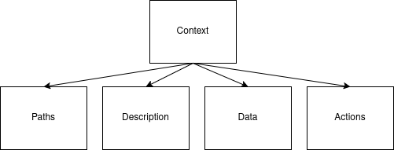

**Course:** ELEC-E8408 Embedded Systems Development, Aalto University  
**Members:** Holappa, Heidi & Lundén, Jaakko-Juhani & Rislakki, Tuomas  
**Group:** I  



**Table of Contents**

1. [Introduction](#introduction)  
    i. [Purpose](#purpose)
    ii. [Scope](#scope)
    iii. [Definitions, acronyms, abbreviations](#definitions-acronyms-and-abbreviations)
    iv. [References](#references)
    v. [Overview](#overview)
2. [Overall description](#overall-description)
    i. [Product Perspective](#product-perspective)
    ii. [Product functions](#product-functions)
    iii. [User characteristics](#user-characteristics)
    iv. [Constraints](#constraints)
    v. [Assumptions and dependencies](#assumptions-and-dependencies)
    vi. [Apportioning of requirements](#apportioning-of-requirements)
3. [Specific Requirements](#specific-requirements)
    i. [Performance requirements](#performance-requirements)
    ii. [Design constraints](#design-constraints)
    iii. [Software-system attribtues](#software-system-attributes)



# Introduction

This chapter highlights the purpose and scope of this document, introduces the essential definitions, acronyms and abbreviations, and lists the relevant references. 

## Purpose


The purpose of this document is to list requirements and provide context and considerations for the proof-of-concept Hiking Band product system. This document is intented be used within software development, integration and testing of the whole system.  
The core audiences for this documents are the product development team and the course instructors, who both review this document and review the final system based on the requirement specification of this document. The finished deliverable MUST match the specification in this documentation. 


## Scope

**The LilyGo Hiking band system** includes a LilyGO T-Watch smartwatch application for recording hiking trips and a separate application for storing trip information into persistent storage and for displaying trip information on a Web Application.  

This proof-of-concept system consists of two hardware components: the Raspberry Pi and the LilyGo watch. The system includes interactable interfaces, hardware, protocols and functionalities which are required for the system to function. This document defines the requirements in detail to give a broad understanding of the product and its use case. 


## Definitions, acronyms and abbreviations

### Definitions

**1.user:** the person, or persons, who operate or interract directly with the product.  

**2.hiking session:** an event during which activity data such as step count, travelled distance and average speed are recorded on the LilyGO smartwatch. The event begins when user pushes "Start" button and ends when user presses "End" button in hiking session view.  

**3.step:** An act or movement of putting one leg in front of the other in walking or running.  

**4.step count:** An approximation of taken steps computed by a step algorithm based on BMA423 accelerometer data.  

**5.distance:** An approximation of travelled distance in kilometers.  

**6.duration:** A count of seconds from the moment counting steps began, based on the RTC module of LilyGO.  

**7.average speed:** An average based on the duration of the hiking session and travelled distance.  

**8.burned calories:** an approximation of calories burned.  

**9.web application:** The application running on the Raspberry Pi including the database and hosting services.  

**10.LilyGo application:** The firmware and applications running on the LilyGo T-Watch smartwatch.  

**11.System:**  The whole system including Raspberry Pi, LilyGo T-Watch smartwatch and relevant interfaces.  

**12.Proof-of-concept:** a pilot project demonstrating that a design concept is feasible.  

**13.SUD:**  System Under Development.  

### Requirement levels

This document uses requirement level keywords "MUST", "MUST NOT", "SHOULD", "SHOULD NOT" and "MAY". The keywords are used to coherently indicate blocking functionalities and requirements from optional and "nice to have" features. The keyword definitions respect the IETF RFC-2119 [2] standard:


| **Keyword** | **Definition** |
| --- | --- |
| MUST | Absolute requirement for the specification. |
| MUST NOT | Absolute prohibition of the specification. |
| SHOULD | Can be ignored with valid reasons. |
| SHOULD NOT | Can be implemented with valid reasons. |
| MAY | Optional, extra. |


## References

This Software Requirement Specification shall be used in conjuction with the following publications:

[1] IEEE 830:1998 IEEE Recommended Practice for Software Requirements Specifications. Available at: [https://ieeexplore.ieee.org/document/720574](https://ieeexplore.ieee.org/document/720574)

[2] RFC-2119. Keywords for use in RFCs to Indicate Requirement Levels. Published in March, 1997. Available at: [https://datatracker.ietf.org/doc/html/rfc2119](https://datatracker.ietf.org/doc/html/rfc2119)

[3] RFC-7231. Hypertext Transfer Protocol (HTTP/1.1): Semantics and Content. Available at: [https://datatracker.ietf.org/doc/html/rfc7231](https://datatracker.ietf.org/doc/html/rfc7231)

The development team should familiarize with the following documents:

[i.] LilyGo T-Watch. LilyGo T-Watch GitHub repository. Available at: [https://github.com/Xinyuan-LilyGO/TTGO_TWatch_Library](https://github.com/Xinyuan-LilyGO/TTGO_TWatch_Library)

[ii.] ESPRESIF documentation. ESP32 Arduino Core's documentation. Available at: [https://docs.espressif.com/projects/arduino-esp32/en/latest/](https://docs.espressif.com/projects/arduino-esp32/en/latest/)


## Overview

This Software Requirements Specification (SRS) document is structured to provide a comprehensive outline of the Hiking Band System and of its requirements. The structure is based on the IEEE 830:1998 standard and is organized by the best practices introduced in IEEE 830:1998 as described below. 

### Content of the SRS

This SRS has three sections:  

1. **Introduction:** This section provides an overview of the entire SRS. It clarifies the context and the objectives of the Hiking Band System and details essential terminology and references.  
2. **Overall description:** This section provides a high-level overview of the SUD (System Under Development). It details the product functionalities, product perspective, constraints and user characteristics.  
3. **Specific Requirements:** This section delves deeper into the technical details of the SUD. It defines the performance requirements, design constraints, software-system attributes and security considerations. 

### Organization of the SRS

This SRS follows the structure recommended in IEEE 830:1998. Each section builds upon previous sections, ensuring that readers gain solid understanding of the System Under Design (SUD).  

1. **Introduction:** Gives an overview of the product, key terminology and details the purpose and the scope of this SRS  
2. **Overall description:** Provides an extensive overview of the systems requirements and constraints  
3. **Specific Requirements:** Breaks the system down into requirements that can be measured and verified based on preset metrics, ensuring that meeting the requirements can be verified during development and testing stages. 


# Overall description

## Product perspective

The product perspective states individual components and their connections within the system. 


> Note: In the above image, naming and other visualizations used MAY not convey the actual final product. However the interconnections and protocols SHOULD represent the actual system.

Using the above block diagram of the whole system we can divide the interfaces to subsections:

The [System interfaces](#system-interfaces) section lists the methods for software to interact with external systems and between major components. 

The [User interfaces](#user-interfaces) section lists the characteristics between the software and the user. 

The [Hardware interfaces](#hardware-interfaces) section lists the characteristics between hardware and software.

The [Software interfaces](#software-interfaces) section lists the characteristics between different software and applications within the system.

The [Communications interfaces](#communications-interfaces) section lists the externally defined communication protocols and their version used within the system.

### System interfaces

The data exchange between the major components MUST happen with structured and coherent application level protocols:

- HTTP and tcp/ip protocols between the web browser and the Web Application
- HTTP-like protocol between the Web Application and the LilyGo Application

The Web Application and the LilyGo Application SHOULD use json format to exchange information.

The LilyGo Application SHOULD use the json structure for the retrieved data when applicable:



For example for /tripdata/4:
```console
{
    "Context": "/tripdata/4",
    "Description": "Individual trip data overview.",
    "Data": {
        "ID": 4,
        "StartTimestamp": "0",
        "EndTimestamp": "0",
        "Steps": 0,
        "AvgSpeed": "0.000000",
        "GeoLocationPath": null
    }
}
```

The communication between Web Application and LilyGo Application MUST adhere to RFC-7231 when using GET and POST methods to inform the nature of the communication.

The communication between Web Application and LilyGo Application SHOULD use the command structure:


Example for GET (example might not be applicable in the final product):
```console
GET /tripdata/4
```

Example for POST (example might not be applicable in the final product):
```console
POST {} /tripdata/4/clear
```

The communication between Web Application and LilyGo Application SHOULD use the filestructure:


The LilyGo Application SHOULD NOT execute its functions without interaction from the user or the Web Application. This means the LilyGo Application has only slave-like properties within the system.

The Web Application SHOULD be able to interact with its resources and the system independently.

### User interfaces

The LilyGO interface user MUST be able to interact with the functionalities:

- "start a hiking session"
- "stop a hiking session"
- "display step count on display"
- "display travelled distance on display"
- "record step count"
- Enable BlueTooth capabilities 

The LilyGO interface SHOULD follow the given interface layout:


> Note: the GUI of the final product may not be a one to one match with the early visualization draft represented here. It will however meet the requirements for functionalities.


The Web UI interface user MUST be able to interact with the functionalities:

- "display a list of past sessions"
- "display the last session"

The Web UI interface SHOULD follow the given interface layout:


### Hardware interfaces

The LilyGO application MUST use the touchScreen FT6336 using the pinout defined by LilyGO hardware:

- SDA: 23 pin
- SCL: 32 pin
- Interrupt: 38 pin

The LilyGO application MUST use the BMA423 using the pinout defined by LilyGO hardware:

- Interrupt: 39 pin

The WebUI HTML layout MUST be viewable in a web browser on Raspberry Pi. In this context viewable means that the user MUST be able to read all information rendered on a web page

The WebUI HTML layout MAY be viewable on a mobile phone screen. 

### Software interfaces

The LilyGO application SHOULD use LilyWatch maintained TTGO_TWatch_Library and Arduino core ESP32 libraries for the pin definitions and driver implementation 

The Web application SHOULD use SQLite to store synchronized data locally on the RPi

The Web application SHOULD use SQLite to store its information

### Communications interfaces

The BlueTooth capabilities MUST use the BlueTooth version v4.2 or below

The Web Application MUST use HTTP and TCP/IP procotols to be able to view the WebUI

The Web Application MUST have ONE of the following capabilities to view the WebUI:

- Able to host its own WiFi access point
- Connect to a local network via WiFi by configuring the correct SSID information
- Connect to a local network via Ethernet by acquiring IP and network information from DHCP.

## Product functions
This subsection contains the functional requirements for the Hiking Application prototype. As the prototype consists of both LilyGo - application and the Web application to present tracking data, the functional requirements gather requirements for both of these.  

### LilyGo application: Start & stop hiking sessions

The system MUST allow user to start a hiking session  

The system MUST allow user to stop a hiking session  

The system MAY allow user to continue stopped hiking session

The system MAY prevent starting a new hiking session, if real-time clock of the smartwatch is compromized. In this case, the smartwatch must be first synchronized with RPi to synchronize the real-time clock. 

### LilyGo application: Recording multiple hiking sessions

The system MUST allow user to record multiple hiking sessions to smartwatch memory 

The system MUST store at minimum 5 last sessions in persistent memory of the smartwatch

The system MAY support storing more than 5 last sessions on the smartwatch

The system MAY warn user if memory capacity is full (max number of sessions have been stored to persistent memory)

The system MAY ask user to override older sessions  

The system MAY prohibit starting new session before memory capacity is released  

The system MAY override the oldest stored session when persistent memory is full

### LilyGo application: Record steps count and convert into travelled distance during the session

While hiking session is active, the system MUST record steps count  

While hiking session is active, the system MUST convert steps count into travelled distance every time data is rendered on touchscreen

### LilyGo application: Display this data on a smartwatch screen

While hiking session is active, the system MUST display step count on display  

While hiking session is active, the system MUST display travelled distance on display  

While hiking session is active, the system MAY display average speed on display

While the hiking session is active the step count and travelled distance MUST update regularly 

The update frequency of hiking session information MAY be optimized with best effort based on hardware constraints

While hiking session is not active, the touchscreen MAY display step count and travelled distance for last session on display

While hiking sessin is active, the smartwatch touchscreen MAY display the current date (YYYY-MM-DD) 

### Synchronize and store data with RPi via Bluetooth

The smartwatch application MUST be capable of sending step count and travelled distance via Bluetooth to the web application on RPi  

The smartwatch application MAY also send date of hike and average speed for each recorded hiking session

The smartwatch application MUST be able to connect to RPi with MAC address that is hard coded to RPi

The smartwatch application MAY be able to connect to RPi with LilyGo enabling Bluetooth discovery

The smartwatch application MAY be able connect to RPi by configured Wi-Fi connection

The smartwatch application MAY be able to find RPi with Wi-Fi discovery

### Calculate estimated amount of calories burned during the session on RPi

The system MUST calculate estimated amount of calories based on travelled distance

### Web application: Initialize Web UI and show last session statistics (travelled distance, step count and burned calories)

The system MUST display travelled distance, step count and burned calories for last session  

The system MUST contain a list of past sessions  

The displayed list of past sessions MUST contain travelled distance, step count and burned calories for each session  

The displayed list of past sessions MAY contain date for each session

The system MAY provide detail view for a chosen session where additional session information is presented

The system MAY provide delete feature for removing past sessions from persistent memory

### Calculating data

Travelled distance MUST be based either on an approximation of the length of an average step or on GPS data   

Approximation of burned calories MUST be based on count of steps and MAY additionally be based on average speed during the trip.   

## User characteristics

This Software Requirements Specification details the features for the proof-of-concept (PoC) version of the system under design (SUD). The system SHOULD be in a stage, in which users with intermediate technical skills with Smartwatches, Bluetooth technology and Raspberry Pi product family can use the product indepentently with the help of the project documentation.  

With the help of the documentation the user MUST be able to know how to 

- clone source code from remote repository (GitHub)
- how to set up virtual environment and install dependencies
- how to flash firmware on LilyGO T-Watch

## Constraints

### System interfaces

- The TWatch has a touchscreen that works as the user interface
- The RPi has a monitor, mouse and keyboard setup that works as a user interface
- The interface between the RPi and TWatch is a Bluetooth connection

### User interfaces

#### TWatch touchscreen interfaces.

- Default interface, has navigation buttons for viewing past sessions, opening the settings menu and moving to the session screen.
- Settings interface, has buttons for configuring the bluetooth connection
- Past sessions interface, contains the current past 5 sessions
- Session interface, has the start and stop session buttons. Shows the current stats for the session.

#### WebUI interfaces

- Home screen shows top and average values of trips and the last trip you have done
- View with a list of all trips, every trip can be deleted from this view
- Configuration view where the setup for the BT connection is and with what intervalls the RPi tries to connect to it

### Hardware interfaces

- WebUI software will run on a RPi 3 and utilize a standard monitor, mouse and keyboard setup.
- The hiking app will use a TWatch v2. If modified a bit it can also use the versions v1 and v3, if the GPS is disabled.

### Software interfaces

- No external softwares required

### Communications interfaces

- The WebUI can be viewed by connecting to the RPi with RealVNC Viewer over the same network using standard network protocols
- The RPi and the TWatch communicate over Bluetooth using a JSON format

### Memory

- The TWatch will only save 5 trips before it starts rewriting the previous information
- The trips will be saved in flash memory

### Operations

- The user will have to first setup the connection between the RPi and the TWatch before being able to synchronize them
- The user will have to synchronize the Watch after the battery runs low enough that the system clock becomes unreliable
- The user will have to synchronize the Watch before they run out of space for trips that have not been synchronized

### Site adaptation requirements

- The current scope of the project does not see it being used anywhere else, so no additional requirements are necessary

## Assumptions and dependencies

- The LilyGo hiking application requires LilyGO T-Watch V2
- The Web Application requires Python 3.10 or higher
- The web application is only guaranteed to work on Raspberry Pi3 
- The clock is either recharged or synchronized regularly between trips to ensure that the real-time clock module is operational. If the clock runs out of battery life, user may not be able to record new hiking sessions. 

## Apportioning of requirements

The proof-of-concept (PoC) MUST include all requirements that have been defined with keywords MUST according to RFC-2119 [2]. All requirements marked with key word MAY are not guaranteed to be implemented in the PoC release. For requirements with keyword SHOULD, design team must be able to justify deviation from SRS. 

# Specific Requirements

## Performance Requirements

- The RPi shall support at least 1 LilyGo watch at a time.

- The maximum time for trips shall be above 2h.

- The watch shall log the location either every 10 or 30 seconds, depending on memory size.

- The watch shall have room for 5 trips.

- The synchronization for transfering data to the RPi shall not fail 2 times in a row.

- The watch refreshes the screen in the trip view every 0.2 seconds or faster.

- The trip data shall be saved on the watch until it is the oldest trip before being overwritten.

- Trip data shall not be overwritten before it has been synchronized.

- Changing the view on the RPi shall be faster than 0.5 seconds.

## Design Constraints

### MUST use atleast predefined hardware

- The system MUST use T-Watch V2

- The system MUST use raspberry pi 2, 3 or 3+

- The system MAY use other hardware

- If the clock runs out of sync due to power loss the system MUST synchronize its time when syncing to the RPi

## Software-system Attributes

### Reliability

- The system MUST log and save the current activity in periodically (15s)
- The system MUST NOT miss 2 consecutive loggings

### Security

- The LilyGo watch MUST only send hiking data to a paired device
- The LilyGo watch MUST only be discoverable during pairing with the RPi
- The RPi MUST periodically check if the watch is within range, the LilyGo MUST NOT attempt to connect to the RPi automatically

