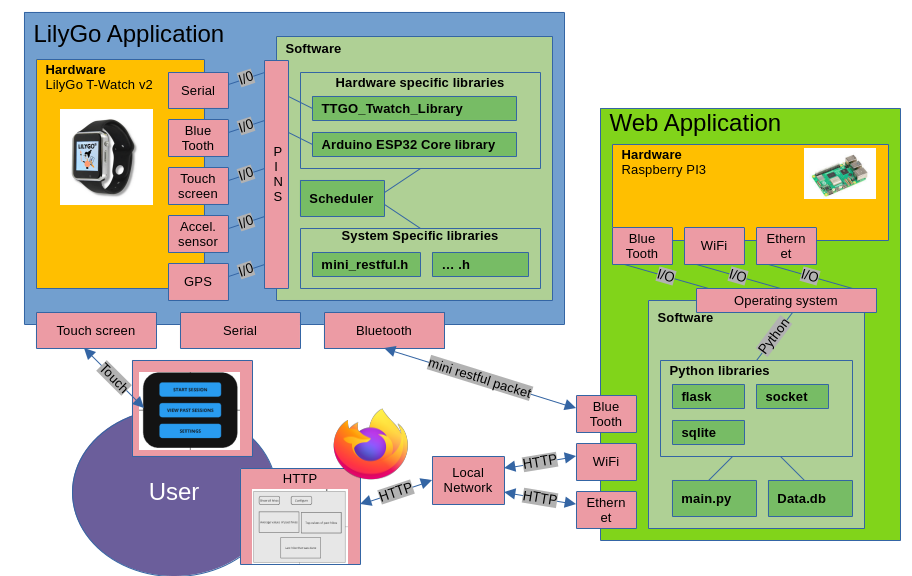



# Introduction

This chapter highlights the purpose and scope of this document, introduces the essential definitions, acronyms and abbreviations, and lists the relevant references. 

## Purpose

The purpose of this document is to list requirements and provide context and considerations for the proof-of-concept Hiking Band product system. This document is intented be used within software development, integration and testing of the whole system.  

The core audiences for this documents are the product development team and the course instructors, who both review this document and review the final system based on the requirement specification of this document. The finished deliverable MUST match the specification in this documentation. 

The SRS is maintained in GitHub remote repository that provides version control. Each release of the Hiking Band system is tagged with a version number and this includes the documentation as well. This way the documentation is also version controlled and the revision history can be efficiently be reviewed with `git blame`, which shows change history and author of each change, with timestamps.  

For each release the SRS SHOULD be updated and represent the current version of the system. The SRS SHOULD also align with User Manual and Design Report in each release. With version control it is also easy to review removed sections of SRS. The SRS should have an Appendix that lists deprecated sections and in which release these sections were removed from the SRS. This way it is easy to find the deprecated sections from past releases, when necessary. 


## Scope

**The LilyGo Hiking band system** includes a LilyGO T-Watch smartwatch application for recording hiking trips and a separate application for storing trip information into persistent storage and for displaying trip information on a Web Application.  

This proof-of-concept system consists of two hardware components: the Raspberry Pi and the LilyGo watch. The system includes interactable interfaces, hardware, protocols and functionalities which are required for the system to function. This document defines the requirements in detail to give a broad understanding of the product and its use case. 


## Definitions, acronyms and abbreviations

### Definitions

**1.user:** the person, or persons, who operate or interract directly with the product.  

**2.hiking session:** an event during which activity data such as step count, travelled distance and average speed are recorded on the LilyGO smartwatch. The event begins when user pushes "Start" button and ends when user presses "End" button in hiking session view.  

**3.step:** An act or movement of putting one leg in front of the other in walking or running.  

**4.step count:** An approximation of taken steps computed by a step algorithm based on BMA423 accelerometer data.  

**5.distance:** An approximation of travelled distance in kilometers.  

**6.duration:** A count of seconds from the moment counting steps began, based on the RTC module of LilyGO.  

**7.average speed:** An average based on the duration of the hiking session and travelled distance.  

**8.burned calories:** an approximation of calories burned.  

**9.web application:** The application running on the Raspberry Pi including the database and hosting services.  

**10.LilyGo application:** The firmware and applications running on the LilyGo T-Watch smartwatch.  

**11.smartwatch application:** The same as LilyGo application

**11.System:**  The whole system including Raspberry Pi, LilyGo T-Watch smartwatch and relevant interfaces.  

**12.Proof-of-concept:** a pilot project demonstrating that a design concept is feasible.  

**13.SUD:**  System Under Development.  

**14.data storage:** A local database created and accessed by the Web Application. The purpose of the data storage is to store data for past hiking sessions and the information of the paired LilyGO T-Watch.   

**15.session data:** Information stored from one hiking session, such as step count and distance in kilometers. 

**16.data tranfer:** A process in which session data is copied from LilyGO T-Watch application to persistent data storage on Web Application.

**17.polling:** An action in which client sends a request to a server. 

**18.request:** A communication from client to server in which client requests an operation from server. In context of Hiking Band system, the Web Application requests data from the LilyGO T-Watch application and the smartwatch application responds by sending data from hiking trips. 

**19.client:** A client is a device communicating with a server

**20.server:** Server is software service that listens to incoming requests and responds to them. 

**21.pairing:** A process in which two devices form an initial connection to enable communication

**22.synchronization:** An operation causing a set of data elements to remain identical in multiple locations. In the context of Hiking Band system synchronization means that session data from LilyGO T-Watch application is copied to persisten data storage on Web Application. Not all data on the persistent data storage MAY NOT be in the LilyGO T-Watch. 


### Requirement levels

This document uses requirement level keywords "MUST", "MUST NOT", "SHOULD", "SHOULD NOT" and "MAY". The keywords are used to coherently indicate blocking functionalities and requirements from optional and "nice to have" features. The keyword definitions respect the IETF RFC-2119 [2] standard:


| **Keyword** | **Definition** |
| --- | --- |
| MUST | Absolute requirement for the specification. |
| MUST NOT | Absolute prohibition of the specification. |
| SHOULD | Can be ignored with valid reasons. |
| SHOULD NOT | Can be implemented with valid reasons. |
| MAY | Optional, extra. |


## References


This Software Requirement Specification MUST be used in conjuction with the following publications:

[1] "IEEE Recommended Practice for Software Requirements Specifications," in IEEE Std 830-1998 , vol., no., pp.1-40, 20 Oct. 1998, doi: 10.1109/IEEESTD.1998.88286. Available at: [https://ieeexplore.ieee.org/document/720574](https://ieeexplore.ieee.org/document/720574)

[2] S. Bradner 1997. RFC-2119: Key words for use in RFCs to Indicate Requirement Levels. Doi: 10.17487/RFC2119. [https://datatracker.ietf.org/doc/html/rfc2119](https://datatracker.ietf.org/doc/html/rfc2119)

[3] R. Fielding, J. Reschke 2014. RFC-7231: Hypertext Transfer Protocol (HTTP/1.1): Semantics and Content. Doi: 10.17487/RFC7231. Available at: [https://datatracker.ietf.org/doc/html/rfc7231](https://datatracker.ietf.org/doc/html/rfc7231)

[4] Barreira TV, Rowe DA, Kang M. 2010. Parameters of walking and jogging in healthy young adults. Int J Exerc Science 2010;3(1).

[5] Wilkin LD, Cheryl A, Haddock BL 2012. Energy expenditure comparison between walking and running in average fitness individuals. J Strength Cond Res. 2012 Apr;26(4):1039-44. doi: 10.1519/JSC.0b013e31822e592c.  


Additionally the development team should familiarize with the following online documents:

[i.] LilyGo T-Watch. LilyGo T-Watch GitHub repository. Cited on 14th of March 2025. Available at: [https://github.com/Xinyuan-LilyGO/TTGO_TWatch_Library](https://github.com/Xinyuan-LilyGO/TTGO_TWatch_Library)

[ii.] ESPRESIF documentation. ESP32 Arduino Core's documentation. Cited on 14th of March 2025. Available at: [https://docs.espressif.com/projects/arduino-esp32/en/latest/](https://docs.espressif.com/projects/arduino-esp32/en/latest/)


## Overview

This Software Requirements Specification (SRS) document is structured to provide a comprehensive outline of the Hiking Band System and of its requirements. The structure is based on the IEEE 830:1998 standard and is organized by the best practices introduced in IEEE 830:1998 as described below. 

<!--
### Content of the SRS

This SRS has three sections:  

1. **Introduction:** This section provides an overview of the entire SRS. It clarifies the context and the objectives of the Hiking Band System and details essential terminology and references.  
2. **Overall description:** This section provides a high-level overview of the SUD (System Under Development). It details the product functionalities, product perspective, constraints and user characteristics.  
3. **Specific Requirements:** This section delves deeper into the technical details of the SUD. It defines the performance requirements, design constraints, software-system attributes and security considerations. 

### Organization of the SRS

-->

This SRS follows the structure recommended in IEEE 830:1998. Each section builds upon previous sections, ensuring that readers gain solid understanding of the System Under Design (SUD).  

1. **Introduction:** Gives an overview of the product, key terminology and details the purpose and the scope of this SRS  
2. **Overall description:** Provides an extensive overview of the systems requirements and constraints  
3. **Specific Requirements:** Breaks the system down into requirements that can be measured and verified based on preset metrics, ensuring that meeting the requirements can be verified during development and testing stages. 



# Overall description

## Product perspective

The product perspective states individual components and their connections within the system. 



> Note: In the above image, naming and other visualizations used MAY not convey the actual final product. However the interconnections and protocols SHOULD represent the actual system.

Using the above block diagram of the whole system we can divide the interfaces to subsections:

The [System interfaces](#system-interfaces) section lists the methods for software to interact with external systems and between major components. 

The [User interfaces](#user-interfaces) section lists the characteristics between the software and the user. 

The [Hardware interfaces](#hardware-interfaces) section lists the characteristics between hardware and software.

The [Software interfaces](#software-interfaces) section lists the characteristics between different software and applications within the system.

The [Communications interfaces](#communications-interfaces) section lists the externally defined communication protocols and their version used within the system.

### System interfaces

The data exchange between the major components MUST happen with structured and coherent application level protocols:

- HTTP and TCP/IP protocols between the web browser and the Web Application
- HTTP-like protocol between the Web Application and the smartwatch application

The Web Application and the smartwatch application SHOULD use JSON format to exchange information.

The smartwatch application SHOULD use the JSON structure for the retrieved data when applicable:




For example for /tripdata/4:
```console
{
    "Context": "/tripdata/4",
    "Description": "Individual trip data overview.",
    "Data": {
        "ID": 4,
        "StartTimestamp": "0",
        "EndTimestamp": "0",
        "Steps": 0,
        "AvgSpeed": "0.000000",
        "GeoLocationPath": null
    }
}
```

The communication between Web Application and smartwatch application MUST adhere to RFC-7231 when using GET and POST methods to inform the nature of the communication. Nature meaning that the content might be different but the act GET and POST act the same way.  

The communication between Web Application and smartwatch application SHOULD use the command structure:


Example for GET (example might not be applicable in the final product):
```console
GET /tripdata/4
```

Example for POST (example might not be applicable in the final product):
```console
POST {} /tripdata/4/clear
```

The communication between Web Application and smartwatch application SHOULD use the filestructure:


The smartwatch application SHOULD NOT execute its functions without interaction from the user or the Web Application. This means the smartwatch application has only slave-like properties within the system.

The Web Application SHOULD be able to interact with its resources and the system independently.

### User interfaces

The LilyGO / smartwatch interface user MUST be able to interact with the functionalities:

- "start a hiking session"
- "stop a hiking session"
- "display step count on display"
- "display travelled distance on display"
- "record step count"
- Enable BlueTooth capabilities 

The LilyGO  / smartwatch interface SHOULD follow the given interface layout:


> Note: the GUI of the final product may not be a one to one match with the early visualization draft represented here. It will however meet the requirements for functionalities.


The Web UI interface user MUST be able to interact with the functionalities:

- "display a list of past sessions"
- "display the last session"




The Web UI interface SHOULD follow the given interface layout:


The LilyGo / smartwatch interface MUST refresh current hiking session every 0.2 seconds or faster.

Changing the view on the Web Application MUST be faster than 0.5 seconds.

### Hardware interfaces

The smartwatch application MUST use the touchScreen FT6336 using the pinout defined by LilyGO / smartwatch hardware:

- SDA: 23 pin
- SCL: 32 pin
- Interrupt: 38 pin

The smartwatch application MUST use the BMA423 using the pinout defined by LilyGO / smartwatch hardware:

- Interrupt: 39 pin

The WebUI HTML layout MUST be viewable in a web browser on Raspberry Pi. In this context viewable means that the user MUST be able to read all information rendered on a web page

The WebUI HTML layout MAY be viewable on a mobile phone screen. 

### Software interfaces

The smartwatch application SHOULD use LilyWatch maintained TTGO_TWatch_Library and Arduino core ESP32 libraries for the pin definitions and driver implementation 

The smartwatch application SHOULD be implemented with the following state machine for a polling scheduler of 6 orthogonal processes. The timing and prioritization MAY be changed to accommodate other requirements:


The Web application SHOULD follow simple polling scheduling of tasks.

The Web application SHOULD use SQLite to store synchronized data locally on the RPi

The Web application MUST atleast implement the functionality of the following UML in within the program:


### Communications interfaces

The BlueTooth capabilities MUST use the BlueTooth version v4.2 or below

The Web Application MUST use HTTP and TCP/IP procotols to be able to view the WebUI

The Web Application MUST have ONE of the following capabilities to view the WebUI:

- Able to host its own WiFi access point
- Connect to a local network via WiFi by configuring the correct SSID information
- Connect to a local network via Ethernet by acquiring IP and network information from DHCP.

## Product functions
This subsection contains the functional requirements for the Hiking Application prototype. As the prototype consists of both LilyGo / smartwatch - application and the Web application to present tracking data, the functional requirements gather requirements for both of these.  

### Smartwatch Application: Start & stop hiking sessions

The system MUST allow user to start a hiking session  

The system MUST allow user to stop a hiking session  

The system MAY allow user to continue stopped hiking session

The system MAY prevent starting a new hiking session, if real-time clock of the smartwatch is compromized. In this case, the smartwatch must be first synchronized with RPi to synchronize the real-time clock. 

### Smartwatch Application: Recording multiple hiking sessions

The system MUST allow user to record multiple hiking sessions to smartwatch memory 

The system MUST store at minimum 5 last sessions in running memory of the smartwatch

The system MAY store at minimum 5 last sessions in persistent memory of the smartwatch

The system MAY support storing more than 5 last sessions on the smartwatch

The system MAY warn user if memory capacity is full (max number of sessions have been stored to persistent memory)

The system MAY ask user to override older sessions  

The system MAY prohibit starting new session before memory capacity is released  

The system MAY override the oldest stored session when persistent memory is full

The maximum time for trips MUST be above 2h.

The watch MUST log the location either every 10 or 30 seconds, depending on memory size if GPS tracking is used.

In case GPS data is tracked, the system MUST log and save the current location in periodically (15s)

In case GPS data is tracked, the system MUST NOT miss 2 consecutive loggings of location data

### Smartwatch Application: Record steps count and convert into travelled distance during the session

While hiking session is active, the system MUST record steps count  

While hiking session is active, the system MUST convert steps count into travelled distance every time data is rendered on touchscreen

### Smartwatch Application: Display this data on a smartwatch screen

While hiking session is active, the system MUST display step count on display  

While hiking session is active, the system MUST display travelled distance on display  

While hiking session is active, the system MAY display average speed on display

While the hiking session is active the step count and travelled distance MUST update regularly 

The update frequency of hiking session information MAY be optimized with best effort based on hardware constraints

While hiking session is not active, the touchscreen MAY display step count and travelled distance for last session on display

While hiking sessin is active, the smartwatch touchscreen MAY display the current date (YYYY-MM-DD) 

### Synchronize and store data with RPi via Bluetooth

The smartwatch application MUST be capable of sending step count and travelled distance via Bluetooth to the web application on RPi  

The smartwatch application MAY also send date of hike and average speed for each recorded hiking session

The smartwatch application MUST at the minimum be able to connect to RPi based on Bluetooth broadcast device name of the smartwatch application

The smartwatch application MAY be able to connect to RPi with smartwatch application enabling Bluetooth discovery

The smartwatch application MAY be able connect to RPi by configured Wi-Fi connection

The smartwatch application MAY be able to find RPi with Wi-Fi discovery

### Calculate estimated amount of calories burned during the session on RPi

The system MUST calculate estimated amount of calories based on travelled distance

### Web application: Initialize Web UI and show last session statistics (travelled distance, step count and burned calories)

The system MUST display travelled distance, step count and burned calories for last session  

The system MUST contain a list of past sessions  

The displayed list of past sessions MUST contain travelled distance, step count and burned calories for each session  

The displayed list of past sessions MAY contain date for each session

The system MAY provide detail view for a chosen session where additional session information is presented

The system MAY provide delete feature for removing past sessions from persistent memory

### Calculating data

Travelled distance MUST be based either on an approximation of the length of an average step or on GPS data   

Approximation of burned calories MUST be based on count of steps and MAY additionally be based on average speed during the trip.

The equations for calory and distance SHOULD use the defined formulas in subsection [Data conversion and formulas](#data-conversion-and-formulas).

## User characteristics

This Software Requirements Specification details the features for the proof-of-concept (PoC) version of the system under design (SUD). The system SHOULD be in a stage, in which users with intermediate technical skills with Smartwatches, Bluetooth technology and Raspberry Pi product family can use the product indepentently with the help of the project documentation.  

With the help of the documentation the user MUST be able to know how to 

- clone source code from remote repository (GitHub)
- how to set up virtual environment and install dependencies
- how to flash firmware on LilyGO T-Watch

## Constraints

The constraints mentioned are only concerning the software of the application, as they are the only ones liable to change. The hardware specifications are set due to the predefined hardware that will be used and as such would only be repeating what the specifications for the different parts are. The hardware used can be found in the hardware interfaces section.

### System interfaces

- The TWatch has a touchscreen that works as the user interface
- The RPi has a monitor, mouse and keyboard setup that works as a user interface
- The interface between the RPi and TWatch is a Bluetooth connection
- the both system components might handle multiple different tasks from multiple interfaces which MUST be scheduled accordingly so other requirements are met.

### User interfaces

#### TWatch touchscreen interfaces.

- Default interface, has navigation buttons for viewing past sessions, opening the settings menu and moving to the session screen.
- Settings interface, has buttons for configuring the bluetooth connection
- Past sessions interface, contains the current past 5 sessions
- Session interface, has the start and stop session buttons. Shows the current stats for the session.

#### WebUI interfaces

- Home screen shows top and average values of trips and the last trip you have done
- View with a list of all trips, every trip can be deleted from this view
- Configuration view where the setup for the BT connection is and with what intervalls the RPi tries to connect to it

### Hardware interfaces

- WebUI software will run on a RPi 3 and utilize a standard monitor, mouse and keyboard setup.
- The hiking app will use a TWatch v2. If modified a bit it can also use the versions v1 and v3, if the GPS is disabled.

### Software interfaces

- No external softwares required

### Communications interfaces

- The WebUI can be viewed by connecting to the RPi with RealVNC Viewer over the same network using standard network protocols or by using the display, keyboard and mouse connected to the RPi
- The RPi and the TWatch communicate over Bluetooth using a JSON format

- The bluetooth interaction the minimum requirements SHOULD use the hard coded BlueTooth broadcast name to determine the correct device. It would be a lot more secure if we can do this from the WebUI without hardcoding. However, this requires more precise interaction with the operating system and the Web Application.

- If the clock runs out of sync due to power loss the system MUST synchronize its time when syncing to the RPi or some there needs to be another way to obtain the sync. The system needs to be aware of this. As the smartwatch application functions has only slavelike properties this requires more action from the RPi.

- The network access of the RPi MUST be made easily configurable and NOT hardcoded to work in one network. 

- The system is designed so the RPi OS SHOULD be only be interacted by the WebUI. This also imposes difficulty in the configuration of the network access.  

- The smartwatch application watch MUST only send hiking data to a paired device

- The smartwatch application watch MUST only be discoverable during pairing with the RPi

### Memory

- The TWatch will only save 5 trips before it starts rewriting the previous information

- The trips MUST be stored in the internal flash memory for the smartwatch application if persistent memory is used.

- The smartwatch application MUST be carefully crafted to account for the hardware restrictions of the TWatch: 

| Restricting factor | Size |
| ------------------ | ---- |
| Flash memory |  16MB |
| PSRAM |  8 MB |
| SRAM | 520 KB |


### Operations

- The user will have to first setup the connection between the RPi and the TWatch before being able to synchronize them
- The user will have to synchronize the Watch after the battery runs low enough that the system clock becomes unreliable
- The user will have to synchronize the Watch before they run out of space for trips that have not been synchronized

### Site adaptation requirements

- The current scope of the project does not see it being used anywhere else, so no additional requirements are necessary

### Data conversion and formulas

In case the optional GPS tracking functionality is not implemented, the length of one step is hard coded as an approximation of average stride length. The value will be based on an equation referenced by Barreira et. al [4]: 42 percent of the person's height. The average height of males in Finland is 180 cm. Thus the average stride length for an average length Finnish male would be  

$$0.42 \cdot 180\,cm = 75.6 cm = 0.756\,m \approx 0.76\,m$$  

In case GPS tracking data is unavailable, travelled distance is simply calculated by  

$$\text{stepCount} \times \text{strideLength}$$  

The calory calculation is based on Wilkin et. al. [5] findings on average energy expenditure for young average health adults. Their findings have been applied to suit the metric system and by converting Kilojoules into calories by using the conversion of 1 kilojoule equalling 239 calories. With this process the calory consumption for 1 km hike is estimated to be 56 calories and thus calory consumption per step is  

$$0.00076 km \cdot 56 = 0.04256\,\text{calories}$$ 

## Assumptions and dependencies

<!--
  Area of improvement
  The assumptions and dependencies section should state how the system handles failures in connectivity or power loss.
-->

### Operational assumptions

- The clock is either recharged or synchronized regularly between trips to ensure that the real-time clock module is operational. If the clock runs out of battery life, user may not be able to record new hiking sessions. 
- The Raspberry Pi is connected to a home network with an IP address.
- The home network does not restrict the use of TCP port 5000
- The Raspberry Pi has access to internet
- All software and firmware has been installed according to the provided installation manual
- The versions of the web application and the hiking application are the same
- The Web application handles the listed exceptions and errors without system failure:

| Exception name | Description | Responsible platform |
| -------------- | ----------- | -------------------- |
| Bluetooth out of range | When smartwatch application is out of range during synchronization. System SHOULD normally carry on operation. | Web Application |
| Bluetooth setup incomplete | Incorrect or wrong MAC or new smartwatch application. Renewing Bluetooth setup is required. | Web Application |
| Power outage | Web Application is forced to restart by power loss | Web Application |
| smartwatch application out of battery | This will not affect the system. Smartwatch application related data SHOULD be reset. Web Application knows which data is already synced from marking. | Web Application / smartwatch application |
| Ongoing session is not synced | Ongoing session is not ready for persistent memory, so it MUST not be synced | Smartwatch application |


### Hardware assumptions

- The smartwatch application requires LilyGO T-Watch V2
- The Web Application requires Python 3.10 or higher
- The web application is only guaranteed to work on Raspberry Pi3 

## Apportioning of requirements

<!--
  Area of improvement:
  Apportioning requirements should be more informative regarding the later stage design implementation.
-->
Apportioning of requirements subsection conveys late stage considerations related to the requirement levels. Requirements follow the selected keywords defined in the [Requirement levels](#requirement-levels) subsection. 

### Requirement prioritization

The proof-of-concept (PoC) MUST include all requirements that have been defined with keywords MUST according to RFC-2119 [2]. All requirements marked with key word MAY are not guaranteed to be implemented in the PoC release. For requirements with keyword SHOULD, design team must be able to justify deviation from SRS. 

In the later stage design and initial releases, careful attention MUST be given to these aspects of this document:

1. Synchronization: Fluent, does not give any unknown errors to the user and the other requirements are carefully inspected.
2. Web Application UI: Usage is fluent, database entries are easily inspected and deleted, database is clearly visualized and the other requirements are carefully inspected. 
3. Smartwatch application: Smartwatch is easily usable, data collected is correct, timestamps are correct, synchronization is fluent and the other requirements are carefully inspected. 

Difficult but convenient requirements that SHOULD be carefully considered in the initial releases due to possible constraints:

1. GPS and other related functionality
2. Persistent storage on the smartwatch application
3. Clock / timestamp on the Smartwatch application may use any way to synchronize the clock. Best practice would be to use the clock from the Web Application.



# Specific Requirements

<!--
  Areas of improvement:
  No mention of traceability, linking each requirement to testable criteria.
  Lack of specific security protocols (e.g., Bluetooth encryption, authentication mechanisms).
-->

The subsection specific requirement conveys each previously listed requirement as a testable criteria. This subsection MAY be used as the baseline for the designer or the tester for testing in between releasable versions of the system. 

Before executing the specific requirement tests it is required to install Web application and Smartwatch Application according to the released installation guides which come with the software. The Smartwatch Application version should match the same version as the Web Application. This prerequisite tests the [User characteristics](#user-characteristics)

## External Interfaces

This subsections lists all tests which can be executed from the end user perspective. Execute the tests in the given order. The tested requirements are defined for this subsection in [Product Functions](#product-functions), [Communications interfaces](#communications-interfaces) and [User Interfaces](#user-interfaces).

### Smartwatch

Execution steps:

1. Make sure the watch has charged for more than 2 hours. Startup the smartwatch Application from the power button.
2. Enable all capabilities and push every button on available atleast once.
3. Explore the user interface and start a hiking session
4. Walk atleast 1km
5. Stop a hiking session 
6. Start another hiking session
7. Walk 100 steps
8. Stop the hiking session
9. Repeat steps 7-8 three times so that the clock has the information of 5 trips. 

Expected results:

1. The system does not crash.
2. Past sessions displays all 5 trips.
3. The trip distance for the first trip does not exceed 15% more of the expected walk distance
4. The other trips step amount does not exceed 15% more of the expected step count.

### Web Application

Execution steps:

1. Setup the Raspberry pi with the Web Application installed to a local network your preferred way (ethernet, wifi (might require use of vnc or external display)). Make sure to note the ip address of the raspberry pi.
2. Make sure the smartwatch has the previously collected data and it hasn't been turned off. Also make sure the smartwatch is near the Raspberry Pi
3. From another end device (for example another computer) open a web browser and connect to the ip address of the raspberry pi. Make sure to include the port 5000. For example: http://192.168.0.4:5000 if the ip of the raspberry pi is 192.168.0.4.
3. From the web page locate the setup device and follow the instructions to setup a new device.
4. After setupping the new device. Locate the button to synchronize data between the Web Application and the Smartwatch application.
5. Locate past sessions view from the web browser.

Expected results:

1. The Web application recognizes the new smartwatch and its mac address
2. Synchronized data is visible in the past sessions page.
3. The past sessions page data (timestamp, steps) is the same as in the smartwatch application.

### System performance

Execution steps:

1. Press buttons on the Smartwatch repeatedly as fast as possible while evaluating the smartwatch refresh rate. 
2. Start a session and walk constantly while evaluating the smartwatch refresh rate
3. Press buttons on the Web application repeatedly as fast as possible while evaluating the view refresh rate.

Expected results:

1. Make sure the refresh rates approximately match the expected refresh rates and thresholds defined in [User Interfaces](#user-interfaces)

## Functions

This subsections lists all tests which tests the internal functionality of the system. Execute the tests in the given order. The tested requirements are defined for this subsection in [System interfaces](#system-interfaces), [Software Interfaces](#software-interfaces) and [Hardware interfaces](#hardware-interfaces).

For hardware interfaces it is assumed that after running the following tests the hardware components are deemed working.

### SmartWatch bluetooth communication 

Execution steps:

1. Make sure smartwatch application is running.
2. Use a serial bluetooth terminal and use bluetooth pair "HIKING_WATCH" or relevant name which relates to your smartwatch (can be downloaded for android) 
3. In the serial bluetooth terminal execute command: GET /
4. From the output JSON locate "Paths" lists and recursively execute GET "PATH" for each found path.
5. If in the input JSON is any "Actions" lists. Execute POST {} "ACTION".

Expected results:

1. Make sure all paths do not return an error if it isn't specifically the error path.
2. Make sure any POST method does what the post method name suggests. For example if there is some action related to tagging. Some tag is set after the POST method.
3. Make sure that at the very least all trips and their data is accessible.

### SmartWatch scheduling and operation

Execution steps:

1. Connect to the serial port of the smartwatch via USB cable
2. Click all buttons atleast once. Press also some buttons multiple times and in fast excession.

Expected results:

1. No errors should be outputted in the serial console
2. The buttons SHOULD output relevant information in the serial console. The relevant information is not incorrect. A good developer would add these checkpoints within the code.

### Web Application scheduling and operation

Execution steps:

1. Make sure that Smartwatch application has atleast one trip over 1 km
2. Use vnc, ssh or a seperate display to connect to the raspberry pi
3. Read the output of the running web application
4. Press all buttons also testing synchronization and setup capabilities

Expected results:

1. The output should not include any syntax or operation errors.
2. If the logs include relevant information of the operation. Make sure they match the input.
3. Manually calculate that the calory and distance calculation matches closely to the equations in [Data Conversion and Formulas](#data-conversion-and-formulas)

## Design constraints

This subsections lists all tests which show that the constraints for the system are met. Execute the tests in the given order. The tested requirements are defined for this subsection in [Constraints](#constraints).

Some of these requirements are already tested in [External Interfaces](#external-interfaces) for example storing multiple trips or synchronization. Also it is assumed that to get this far the memory requirements are met as the installation was succesful. This subsection will focus on standards and other externally imposed restrictions for example used formats.

### Standards Compliance

Execution steps:

1. Make sure smartwatch application is running.
2. Use a serial bluetooth terminal or putty and use bluetooth pair "HIKING_WATCH" or relevant name which relates to your smartwatch (can be downloaded for android). You can also use the serial interface using Putty or Picocom.
3. In the selected serial communication execute command: GET /
4. From the output JSON locate "Paths" lists and recursively execute GET "PATH" for each found path.
5. Copy and paste the output to a terminal verify the JSON format is up to standard. Example using linux commandline:

```console
echo "COPYPASTED JSON OUTPUT" | jq
 ```

Expected results:

1. The selected JSON verification tool does not report any errors.

### Realtime Clock Compliance

Execution steps:

1. Reset the smartwatch application.
2. Use a serial bluetooth terminal or putty and use bluetooth pair "HIKING_WATCH" or relevant name which relates to your smartwatch (can be downloaded for android). You can also use the serial interface using Putty or Picocom.
3. Synchronize clock multiple times by navigating through the Smartwatch application or the web application.
4. Make a new trip and after taking a few steps stop the trip
5. In the selected serial communication execute command: GET /tripdata/0 or similar by navigating the "mini restful" paths.

Expected results:
1. The output of the "mini restful" should include a timestamp that matches reallife date time 

### HTML and javascript compliance

Execution steps:

1. Use web browser to connect to the Web Application
2. Press f12 and navigate through all pages

Expected results:
1. The web browser debugger should not show any significant or unexpected errors.

## Software System Attributes

This subsections lists all tests which show that the constraints are also met in edge cases. Some tests check for compliance widely accross the requirements within this document. Especially the listed edge cases in [Assumptions and Dependencies](#assumptions-and-dependencies) are checked.

This also lists good unviersal tests related to embedded system security and maintainability. These are not necessarily explicitly listed requirements in this document but good checks for system operatibility and security.

### Reliability 

Execution steps:

1. Make sure the watch has charged for more than 2 hours. Startup the smartwatch Application from the power button.
2. Enable all capabilities and push every button on available atleast once.
3. Explore the user interface and start a hiking session
4. Walk atleast 2 hours
5. Make sure the values are still changing when walking
6. End the hiking session. 
7. Shutdown the Smartwatch application
8. Try synchronizing from the Web Application while the smartwatch is turned off
9. Turn off the Raspberry Pi as if there was an power outage
10. Wait 10 seconds
11. Turn on the Raspberry Pi and the Hiking watch application
12. The web application should automatically load. Try setupping the Hiking Watch
13. Start a hiking session and after small time period try to synchronize data

Expected results:

1. The system does not crash or shutdown during the 2 hour walk.
3. The trip distance for the first trip does not exceed 15% more of the expected walk distance
4. The other trips step amount does not exceed 15% more of the expected step count.
5. When hiking watch is turned off: the synchronization should fail expectedly but the system should continue working.
6. The Web Application should automatically load up
7. When hiking session isongoing atleast the current session should not be synchronized.

If the test succeeds it complies with the tested edge cases in [Operational Assumptions](#operational-assumptions).

### Security

Execution steps:

1. Setup a new Smart Watch in the Web Application while the Smart watch is turned on
2. Recompile and upload new image to Smart Watch
3. Create multiple new sessions by starting and stopping a new session.
4. Try to synchronize new device

Expected results:

1. The synchronization should fail as the new smart watch doesn't have the correct MAC-address which is used as a password for the system.

### Maintainability

Execution steps:

1. Scroll through the code for Smart Watch application and see for duplicates of variables.
2. Scroll through the code for Smart Watch application and that the main function (scheduler) is responsible for all interactions between modules.
3. Scroll through the code for the Web Application and make sure differnet functionalities are in their seperate code and include helpful docstrings.

Expected results:

1. The code should be modular and different features should be in their own header files. The main function clearly shows the behaviour of the application