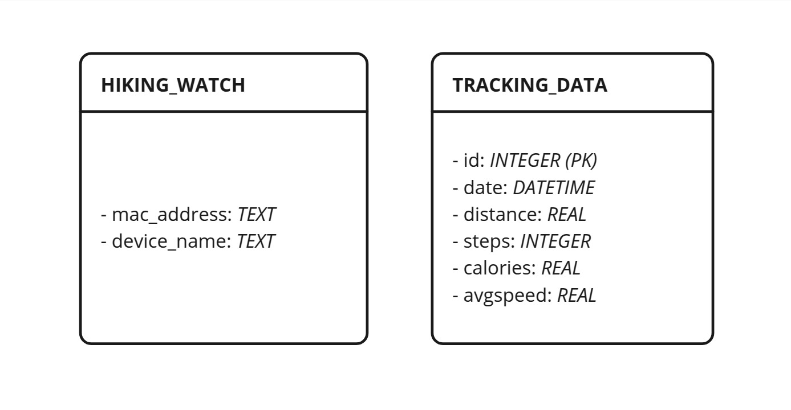




# Introduction

This document is a comprehensive technical document for future developers and maintainers. Section 2 provides a detailed list of dependencies required for the project. Section 3 showcases step-by-step instructions on how to download, setup. compile the project source code and to flash the binary to the smartwatch. Followed by this, section 4 provides key architectural diagrams, a database schema, metadata information and additional structural details that were not yet covered in the Software Requirements Sepcification (SRS). 


# List of dependencies


## Web application

The Web Application is a Python 3.x application that works on versions 3.10 and greater. The dependencies for the application are listed below and can be found in requirements.txt: 

- astroid==3.3.8
- autopep8==2.3.2
- blinker==1.9.0
- click==8.1.8
- dill==0.3.9
- Flask==3.1.0
- greenlet==3.1.1
- isort==5.13.2
- itsdangerous==2.2.0
- Jinja2==3.1.5
- MarkupSafe==3.0.2
- mccabe==0.7.0
- platformdirs==4.3.6
- pycodestyle==2.12.1
- pylint==3.3.3
- python-dotenv==1.0.1
- tomli==2.2.1
- tomlkit==0.13.2
- typing_extensions==4.12.2
- Werkzeug==3.1.3


In this proof-of-concept Hiking Band system, the web application is built to run on a Raspberry Pi3B+ board with a Raspian Operation System. The web application requires a network connection to access external style libraries. 


## LilyGo T-Watch

The LilyGO T-Watch application is an Arduino application. The project officially supports LilyGo T-Watch V2, but MAY also work with V3 with configuration adjustment. Some code segments in source code are dependent on the chosen smartwatch version. 

The smartwatch development has the following dependencies

- arduino-cli v. 1.1
- esp32 libraries v. 2.0.14
- python 3.10 or greater
- pyserial 3.5

# Step-by-step instructions 

## LilyGO T-Watch: Installation and setup

Follow these instructions to set up the LilyGo Hiking application. Please pay careful attention to version numbers to ensure that installation proceeds successfully. 

### Option 1

#### Arduino-cli and esp32 libraries

1. Install arduino-cli (v.1.1):

[https://arduino.github.io/arduino-cli/1.1/](https://arduino.github.io/arduino-cli/1.1/)

2. Install esp32 libraries (v.2.0.14)

```console
arduino-cli core update-index --config-file arduino-cli.yaml

arduino-cli core install esp32:esp32@2.0.14

python3 -m pip install pyserial
```

3. Test your board

```console
arduino-cli board list

Port         Protocol Type              Board Name FQBN Core
/dev/ttyUSB0 serial   Serial Port (USB) Unknown
```

#### Compilation and upload to esp32

Use the following table to make your compilation:

|  Device                |    Board/FQBN              |
| ---------------------- | -------------------------- |
| ESP32_WROOM_32         |  esp32:esp32:esp32-poe-iso |
| LILYGO_WATCH_2020_V2   |  esp32:esp32:twatch        |
| LILYGO_WATCH_2020_V3   |  esp32:esp32:twatch        |

For example for TWATCH V3:

```console
DEVICE="LILYGO_WATCH_2020_V3"
FQBN=esp32:esp32:twatch
arduino-cli compile --fqbn $FQBN \
                    --build-path $(pwd)/build \
                    --build-property "build.extra_flags=-D $DEVICE -D ESP32" .
arduino-cli upload -p /dev/ttyUSB0 \
                   --fqbn esp32:esp32:esp32-poe-iso \
                   --input-dir $(pwd)/build .
```

::: {.callout-note}
The device path may not be `/dev/ttyUSB0`. To verify the name of the USB-device, connect the smartwatch with the cable and use command `ls /dev/tty*`. 
:::


### Option 2

configure config.ini 

```console
./install.sh
```

This convenience script provides the option to enable the web application to start on startup so it is usually recommended to be used.

::: {.callout-tip}
The config.ini contains LilyGo T-Watch versions V2 and V3. To change the T-Watch version, change which version is uncommented. V3 is not officially supported, but both V2 and V3 T-Watches were used during development stage. 

- When V2 is selected, the GPS module in V2 is used. 
- With V3 distance is calculated based on an hard coded step length as detailed in the SRS. 
:::

### Debugging

Add read and write access to usb device:

```console
chmod 777 /dev/ttyUSB0
```

Read the serial:

```console
picocom -b 115200 /dev/ttyUSB0
or
putty
or
screen /dev/ttyUSB0 115200
```

## Web Application: Installation and setup

### Requirements 

The web application and the scripts have been designed for a Linux based Operating System. It is recommended to use the application on a Linux based Operating System. The web application officially supports Raspberry Pi3B+ with a Raspian Operating System.  

The minimum Python version is 3.10. Versions for dependencies are listed in requirements.txt. Use of virtual environment is adviced, as detailed below in installation instructions.

These instructions assume that the user is using a Linux based Operating System with a bash terminal emulator. The installation may either be done manually or by using a convenience script provided in the project repository. 

### Option 1: Manual installation

First setup the virtual environment

```bash
python3 -m venv venv
```

Then install dependencies

```bash
pip install -r requirements.txt
```

If you add new dependencies, create an updated `requirements.txt` with the following command:
```bash
pip freeze > requirements.txt
```

### Option 2: Convenience script

Run the installation script with

```bash
./install.sh
```

:::{.callout-tip}
Using the script is advisable. It for instance verifies that the currently active Python3 installation meets system requirements.
:::


## Running the application

Running the application may also be done manually or by using a convenience script. 

### Option 1: Manually

To run the app use 

```bash
flask --app src/app.py run
```

To debug:

```bash
flask --app src/app.py --debug run
```


### Option 2: Convenience script

To run the app use 

```bash
./start-app.sh
```

To debug:

```bash
./start-app.sh debug
```


# Technical documentation

Please refer to SRS for technical documentation, including architectural diagrams, database schema, metadata and structural designs.    


## Architectural diagrams

The Software Requirements Specification (SRS) document contains multiple architectural diagrams:
- Section 2.1 details the major component level
- Section 2.1.2 details the user interfaces
- Section 2.1.4 presents the software interfaces

## Database schema

For this Proof-of-Concept system the database schema is simple. There are two tables with no relation to each other. 

- HIKING_WATCH: Contains the information for the paired LilyGO T-Watch. Currently this table MUST only have one entry
- TRACKING_DATA: each entry contains information from a single past hike



## Metadata

The relevant metadata for API endpoints and transferrable information has been detailed in SRS document section 2.1.1 System interfaces. 

## Structural designs 

::: {.callout-important}
TODO: What should be here? 

Ideas:
- technology stack and justification
- database justification (why SQL with no relations)
:::

## Visual context of implemented solution

Visual context of implemented system can be reviewed in the User Manual PDF. It contains tutorials with visualizations for both the LilyGO T-Watch Hiking application and the Raspberry Pi Web Application. 


## LilyGO Hiking application: Documentation by module

This section details the LilyGO T-Watch Hiking Application code structure by module for the version 1.0 release. 

### accelerator


#### hidden

TFT_eSPI *tft: Currently deprecated value.
BMA *sensor: Contains the pointer to the accelometers sensor given by the ttgo object.
bool irqAcc: boolean value depicting if the sensor has executed an interrupt. Is set as false at the beginning.

#### public

void initAccelerator(TTGOClass *ttgo): Initializes the accelerator from the ttgo object.
uint32_t handleTasksAccelerator(): Function for reading the sensors current steps.
void resetAccelerator(): Resets the accelerators stepcount.

### bluetooth

#### hidden

#### public

### config

#### public

#define TOUCH_INT: Value needed for compilation. Set as 900909421094219090421.
#define MAX_CACHED_TRIPS: Used to find out about the maximum amount of cached trips on the clock.

### data

#### public

#define GEO_MAX_SIZE: Int with the size the arrays of the geoData struct are initilized as.
typedef struct timeStamp: A type containing a timestamp consisting of members year, month, day, hour, minute and second. Year is of type uint16_t and the rest of type uint8_t.
typedef struct geoData: A type for containing GPS data. Has members lattitude, longitude, datalen and timestamp. Lattitude and longitude are a array of double of size GEO_MAX_SIZE, datalen is of type int and timestamp is of type timeStamp
typedef struct tripData: A type for storing the data of a single trip. Contains the members tripID of type int, stepCount of type uint32_t, avgSpeed of type float, distance of type float, synced of type bool and timestampStart and timestampStop of type timeStamp.
typedef struct systemGlobals: A type for storing general information duroing the execution of the program. It has the members step_length of type float, currentTrip of type int, maxTrip of type int and hasActiveSession and GPSavailable of type bool.

### globals

#### public

timeStamp createTimestampFromRTC(RTC_Date date): function converting a RTC_Date object into a timeStamp struct. It transfers the values of year, month, day, hour, minute and second to the members of a timeStamp struct with the same names.
float getTimeDifference(timeStamp start, timeStamp stop): Returns a float containing the time difference between two timeStamp objects. The unit of measurement is second.

### gps

#### hidden

TinyGPSPlus *gps: Pointer to store the gps object from the ttgo object.
HardwareSerial *GNSS: Pointer to the hardware serial of the ttgo.

double lastLat: Double value containing the latitude of the last step.
double lastLon: Double value containing the longitude of the last step.

double avgLat: Double value containing a sum of the latitudes that will be used to calculate the average latitude of a time period.
double avgLon: Double value containing a sum of the longitude that will be used to calculate the average longitude of a time period.
int avgCount: Counter for determining the amount of points in calculating the average.

uint32_t last: Deprecated variable containing the millis() result when initializing the gps.
uint32_t updateTimeout: Deprecated variable.
bool Quectel_L76X_Probe(): Function cerifying that the gps settings are correct.

#### public

typedef struct GPSPoint: Contains latitude of type double, longitude of type double and dist of type double. The lat and lon are the the latitude and longitude of a point and dist is the distance from the last point.
void initGPS(TTGOClass *ttgo): Function initializing the GPS. Uses the ttgo object.
void updateGPS(): Function to update the gps values.
double getLatitude(): Gets the latest latitude from the gps.
double getLongitude(): Gets the latest longitude from the gps.
GPSPoint takeStep(): Function to take a step in the trip. Returns a GPSPoint with the current latitude and longitude of the position and the distance to the last step.
void setRTCTime(PCF8563_Class *rtc): Function to set the current RTC time of the clock to the current GPS time.
bool isGPSavailable(): Checks if the gps has been updated and the value is valid.
void addValueToAverage(): Adds the current latitude and longitude to the avgLat and avgLon variables. Additionally adds 1 to the avgCount.
GPSPoint takeAverageStep(): Function to take a step in the trip using average values. It returns a GPSPoint containing the avgLat and avgLon divided by avgCount. The distance is the distance between the average coordinates and the last step.

### interface

#### hidden

bool displayOn: Variable tracking if the display is on or off.
bool irqPEK: Variable tracking if the PEK button is pressed.
bool GPSavailable: Deprecated variable.
uint32_t stepCount: Variable for saving the current stepcount.
float step_length: Variable containing the length of a step.
float avgSpeed: Variable containing the current average speed.
float distance: Variable containing the current distance.
timeStamp sessionStartTime: Variable containing the start time of the session.
timeStamp currentTime: Deprecated variable for containing the current time.
bool hasActiveSession: Variable for tracking if a session is currently active.
uint32_t nOfTrips: Variable containing the amount of taken trips.
tripData *pastTrips: Variable containing a pointer to the tripdata object.
interfaceEvent returnData: InterfaceEvent containing the current event.

There are a lot of variables of type lv_obj_t* containing the pointers to different interface elements like the views, buttons and labels.

Variables of type lv_style_t are for saving different styles.

static void event_handler(lv_obj_t *obj, lv_event_t event): Function for handling interface events.
void refreshSessionView(): Function for updating the session view.
void init_global_styles(): Function for setting the global style configuration.
void loopWakeUpFormTouchScreen(TTGOClass *ttgo): Function for handling turning the screen on and off using the PEK button.
void setupToggleScreen(TTGOClass *ttgo): Function for setting up screen on and off functionality.

#### public

typedef enum interfaceEventType: Enum containing the different types of interface events.
typedef struct interfaceEvent: Struct containing a interfaceEventType of the value of the event and a char pointer to a null terminated string containing a message.
void createMainMenuView(): Function creating the view of the main menu.
void createSessionView(): Function creating the view for the current session.
void createSettingsView(): Function creatig the view for the settings menu.
void createPastSessionsView(): Function creating the view for the past session.
void updatePastSessionData(): Function for updating the view of the past sessions.
void initInterface(TTGOClass *ttgo): Function for initializing the interface variables.
interfaceEvent handleTasksInterface(TTGOClass *ttgo, tripData * trip, systemGlobals * systemVariables, bool isRefreshSessionView, tripData * trips): Function for handling tasks concerning the interce and updating it.

### restful

#### hidden

#### public

### serial

#### hidden

bool commandFinishedSer = 0;
int byteCountSer = 0;
char rxDataSer[SERIAL_BUFFER_SIZE]; 

#### public

typedef enum serialStatus: Enum depicting the status of the serial interface.
typedef struct serialBuffer: Struct containing buf of type char*, bufLen of type int and status of type serialStatus.
void initSerial(): Function initializing the serial functionality.
serialBuffer handleSerialByte(): Function reading a byte per call and append to a buffer.
void writeSerialString(char * data): Writes the data variables contents to serial.
void writeSerial(char * data, int dataLen): Writes the data variables contents to serial up to datalen.
void writeSerialRTCTime(): Deprecated function for writing the RTC time to serial.
void writeSerialRTCDateObj(RTC_Date date): Function writing the date objects information to serial.
void writeSerialRTCDateObj(timeStamp date): Function writing the date objects information to serial.