


# Introduction

This document is a comprehensive technical document for future developers and maintainers. Section 2 provides a detailed list of dependencies required for the project. Section 3 showcases step-by-step instructions on how to download, setup. compile the project source code and to flash the binary to the smartwatch. Followed by this, section 4 provides key architectural diagrams, a database schema, metadata information and additional structural details that were not yet covered in the Software Requirements Specification (SRS).  

This documentation should be used with the SRS and the User Manual, both included in the final submission of Hiking Band System version 1.0 submission. Much of the techical details are documented in the SRS document and the User Manual contains instruction on how to use the system with screenshots providing visual context.  




# List of dependencies

## LilyGo T-Watch

The LilyGO T-Watch application is an Arduino application. The project officially supports LilyGo T-Watch V2, but MAY also work with V3 with configuration adjustment. Some code segments in source code are dependent on the chosen smartwatch version. 

The smartwatch development has the following dependencies

- arduino-cli v. 1.1
- esp32 libraries v. 2.0.14
- python 3.10 or greater
- pyserial 3.5

## Web application

The Web Application is a Python 3.x application that works on versions 3.10 and greater. The dependencies for the application are listed below and can be found in requirements.txt: 

- astroid==3.3.8
- autopep8==2.3.2
- blinker==1.9.0
- click==8.1.8
- dill==0.3.9
- Flask==3.1.0
- greenlet==3.1.1
- isort==5.13.2
- itsdangerous==2.2.0
- Jinja2==3.1.5
- MarkupSafe==3.0.2
- mccabe==0.7.0
- platformdirs==4.3.6
- pycodestyle==2.12.1
- pylint==3.3.3
- python-dotenv==1.0.1
- tomli==2.2.1
- tomlkit==0.13.2
- typing_extensions==4.12.2
- Werkzeug==3.1.3


In this proof-of-concept Hiking Band system, the web application is built to run on a Raspberry Pi3B+ board with a Raspian Operation System. The web application requires a network connection to access external style libraries. 



# Step-by-step instructions 

## LilyGO T-Watch: Installation and setup

Follow these instructions to set up the LilyGo Hiking application. Please pay careful attention to version numbers to ensure that installation proceeds successfully. 

### Option 1: manual installation

#### Arduino-cli and esp32 libraries

1. Install arduino-cli (v.1.1):

[https://arduino.github.io/arduino-cli/1.1/](https://arduino.github.io/arduino-cli/1.1/)

2. Install esp32 libraries (v.2.0.14)

```console
arduino-cli core update-index --config-file arduino-cli.yaml

arduino-cli core install esp32:esp32@2.0.14

python3 -m pip install pyserial
```

3. Test your board

```console
arduino-cli board list

Port         Protocol Type              Board Name FQBN Core
/dev/ttyUSB0 serial   Serial Port (USB) Unknown
```

#### Compilation and upload to esp32

Use the following table to make your compilation:

|  Device                |    Board/FQBN              |
| ---------------------- | -------------------------- |
| ESP32_WROOM_32         |  esp32:esp32:esp32-poe-iso |
| LILYGO_WATCH_2020_V2   |  esp32:esp32:twatch        |
| LILYGO_WATCH_2020_V3   |  esp32:esp32:twatch        |



For example for TWATCH V3:

```console
DEVICE="LILYGO_WATCH_2020_V3"
FQBN=esp32:esp32:twatch
arduino-cli compile --fqbn $FQBN \
                    --build-path $(pwd)/build \
                    --build-property "build.extra_flags=-D $DEVICE -D ESP32" .
arduino-cli upload -p /dev/ttyUSB0 \
                   --fqbn esp32:esp32:esp32-poe-iso \
                   --input-dir $(pwd)/build .
```

::: {.callout-note}
The device path may not be `/dev/ttyUSB0`. To verify the name of the USB-device, connect the smartwatch with the cable and use command `ls /dev/tty*`. 
:::


### Option 2: convenience script

First select the correct smartwatch version from config.ini. Then use the convenience script:

```console
./install.sh
```


::: {.callout-tip}
The config.ini contains LilyGo T-Watch versions V2 and V3. To change the T-Watch version, uncomment the version to use and comment the version that is not to be used. V3 is not officially supported, but both V2 and V3 T-Watches were used during development stage. 

- When V2 is selected, the GPS module in V2 is used. 
- With V3 distance is calculated based on an hard coded step length as detailed in the SRS. 
:::

### Debugging

Add read and write access to usb device:

```console
chmod 777 /dev/ttyUSB0
```



Read the serial:

```console
picocom -b 115200 /dev/ttyUSB0
or
putty
or
screen /dev/ttyUSB0 115200
```

## Web Application: Installation and setup

### Requirements 

The Hiking Tour Assistant Data Storage web application and the scripts have been designed for a Linux based Operating System. The web application officially supports Raspberry Pi3B+ with a Raspian Operating System.  

The minimum Python version is 3.10. Versions for dependencies are listed in requirements.txt. Use of virtual environment is adviced, as detailed below in installation instructions.

These instructions assume that the user is using a Linux based Operating System with a bash terminal emulator. The installation may either be done manually or by using a convenience script provided in the project repository. 

### Option 1: Manual installation

First setup the virtual environment

```bash
python3 -m venv venv
```

Then install dependencies

```bash
pip install -r requirements.txt
```

If you add new dependencies, create an updated `requirements.txt` with the following command:
```bash
pip freeze > requirements.txt
```

### Option 2: Convenience script

Run the installation script with

```bash
./install.sh
```

:::{.callout-tip}
Using the script is advisable. It for instance verifies that the currently active Python3 installation meets system requirements.
:::


## Running the application

Running the application may also be done manually or by using a convenience script. 

### Option 1: Manually

To run the app use 

```bash
flask --app src/app.py run
```

To debug:

```bash
flask --app src/app.py --debug run
```


### Option 2: Convenience script

To run the app use 

```bash
./start-app.sh
```

To debug:

```bash
./start-app.sh debug
```


# Technical documentation

Please refer to SRS for technical documentation, including architectural diagrams, database schema, metadata and structural designs.    


## Architectural diagrams

The Software Requirements Specification (SRS) document contains multiple architectural diagrams:

- Section 2.1 details the major component level
- Section 2.1.2 details the user interfaces
- Section 2.1.4 presents the software interfaces

## Database schema

For this Proof-of-concept system the database schema is simple. There are two tables with no relation to each other. 

- HIKING_WATCH: Contains the information for the paired LilyGO T-Watch. Currently this table MUST only have one entry
- TRACKING_DATA: each entry contains information from a single past hike


## Metadata

The relevant metadata for API endpoints and transferrable information has been detailed in SRS document section 2.1.1 System interfaces. 

## Structural designs 

The structural detail has been detailed to some extent in SRS. Here we will focus attention on selected design decisions.  

As the purpose of this project was to build a proof-of-concept system specifically for the LilyGO T-Watch V2, the decision to use the official LilyGO T-Watch libraries was decided to be a good approach. These libraries have limitations, but for the scope of this project their capabilities were satisfactory. Arduino provided both good support for ESP32 and an easy platform for developers with different levels of experience with C and C++ to engage in the project.  

For the web application we decided to write the application in Python, use flask as a framework and store data into sqlite3 relational database. For the purpose of this project Python was considered to be a good choice. Python excels in quick prototyping of ideas and is easy to use. Flask is a mature framework for building simple, but still robust web applications and suited the needs of the project well.  

A relational database was considered to be a sensible choice for this project. The structure of the data was known before hand and all of the developers had previous experiences with relational data. Due to these reasons, it was quick to setup a relational persistent data storage and all developers were able to work with the databsae with relative ease.  

Both projects included convenience scripts that helped setup environments and to build or run projects. The motivation to maintain these was to enable developers with different expertise to easily participate in different parts of development.  


## Visual context of implemented solution

### LilyGO T-Watch hiking application


The LilyGO T-Watch library provides easy means to access the power control of the smartwatch. The PEK button is programmed to toggle the smartwatch screen on and off. In both states the smartwatch is still powered on and remains at full computational capability. 

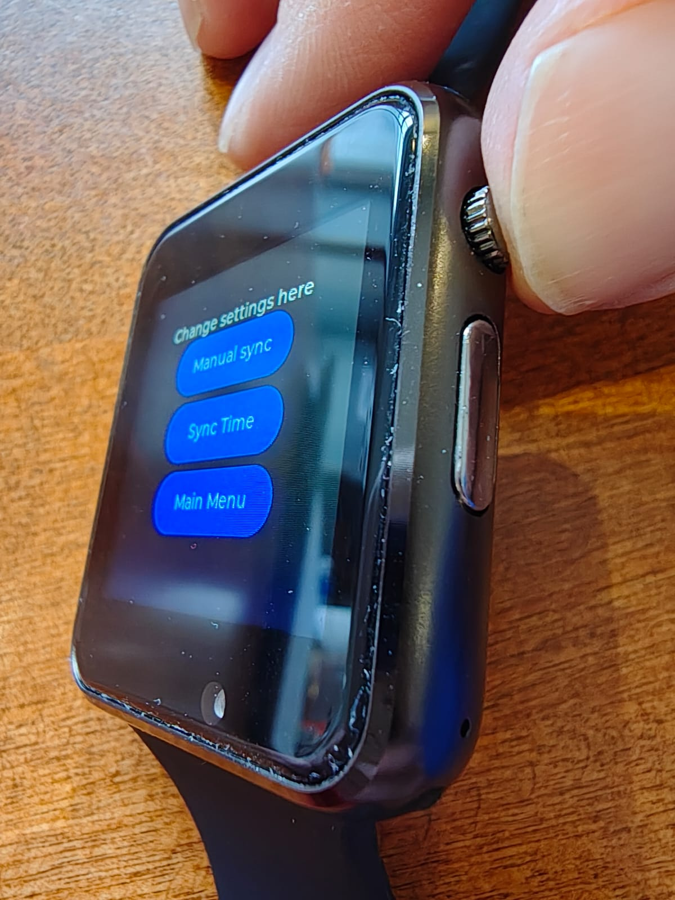{width=30%}  


The LilyGO T-Watch library contains a stripped version of LVGL library. Not all features of LVGL are available and LilyGo libarries documentation is quite limited regarding this. The team found the best way to find available features to be reading the LilyGO T-watch libraries source code.  

The styling of elements is based on styles available in the T-Watch library by default. Colors use high contrast for better accessibility and colors are used to improve user experience. T-Watch libraries LVGL-functions included align-functionalities, which were used to place the elements to fixed positions on each view. 

{width=30%}  



The application loop updates the user inteface in preset frequency. The frequency is hard coded into a constant value in the main `ino` file. The Session view is the only view with elements that are updated without user pressing anything on the touch screen: when the hiking session is in progress, the data values on session view are updated frequently.  

Based on documentation, the LVGL library contains useful features that detect changes in rendered elements and re-render just needed parts of the view. 

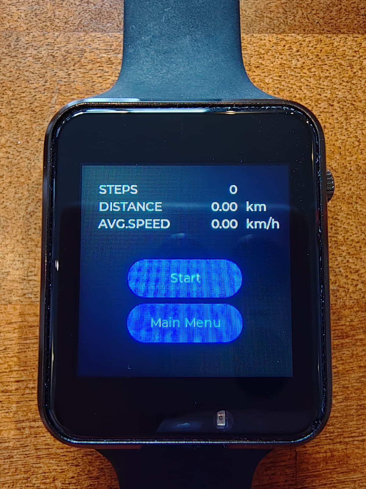{width=30%}


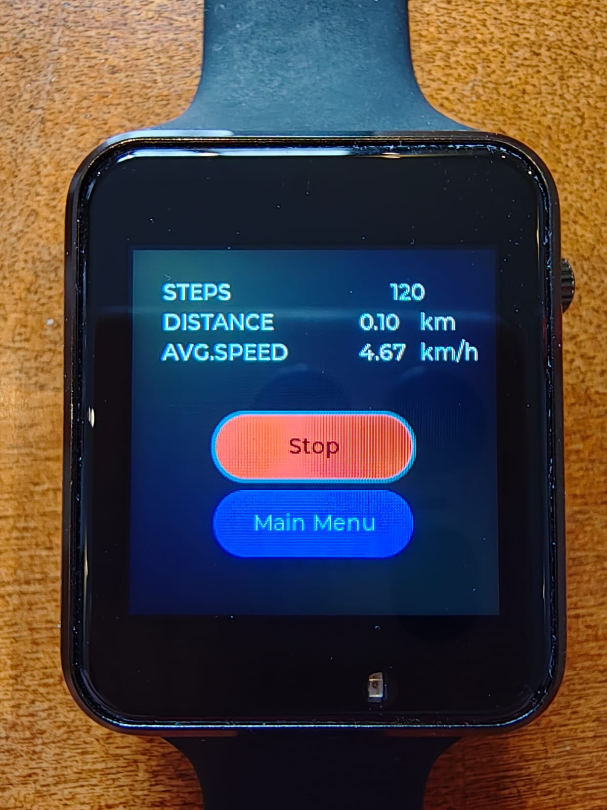{width=30%}



The screen size of LilyGO T-Watch smartwatch is quite limited. Due to this, it was decided to show only selected data values on the past sessions view. Additionally the stripped version of LVGL library contains only a limited number of fonts and font sizes. This also constrained the design decisions. 

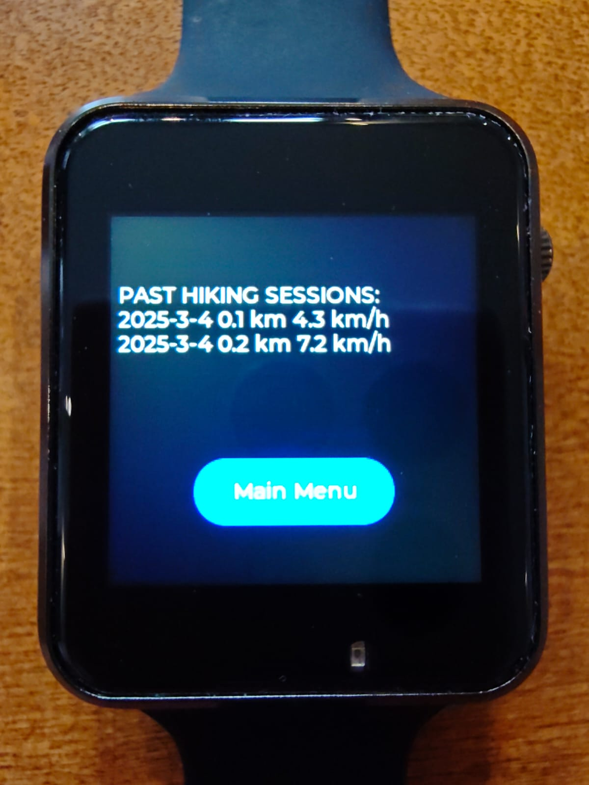{width=30%}

The LilyGO T-Watch's Real Time Clock (RTC) module may go out of sync due to power loss. The RTC module informs of this with a flag. Due to this, it was decided to include a functionality to synchronize the time from the GPS data. 


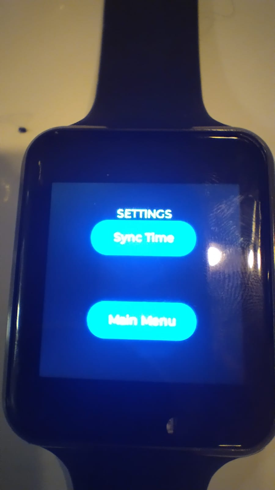{width=25%}


### Web Application: Hiking Tour Assistant Data Storage

For the Web Application it was decided to use Bootstrap CSS framework. Bootstrap provides modern, accessible style elements that work on many platforms. Bootstrap CSS framework may be included as a external dependency requiring an internet connection, or as a standalone local version. For this project it was decided to use the external dependency, as an early assumption was that the Raspberry Pi is connected to the local network with access to internet.  

Each view has been placed in to a container to ensure consistent user experience on each view. The containerized elements also have attributes instructing how to position in different screen configurations. The application is not guaranteed to be responsive, but it has responsive characteristics.   

On the main view button elements and card elements have been used. Cards display selected data values that may be interesting and motivating for the user.  

{width=60%}


The past hikes view contains a simple table element to which data entries in the persistent data store are rendered. 

{width=60%}

Each row contains a delete button that allows user to delete a selected entry. Pressing the delete button activates a modal element that contains a confirmation for the deletion. Note that the modal element is dependent on the Bootstrap JavaScript scripts included in the view. Not all Bootstrap elements require the scripts, but some do. Refer to the Bootstrap documentation for more information on this. 

{width=60%}

The configuration view provides users functionalities to pair a new device and to synchronize data from the smartwatch to the persistent data storage on the Web Application. Before pairing has been done, the card element on the view informs user that no device has been paired. 

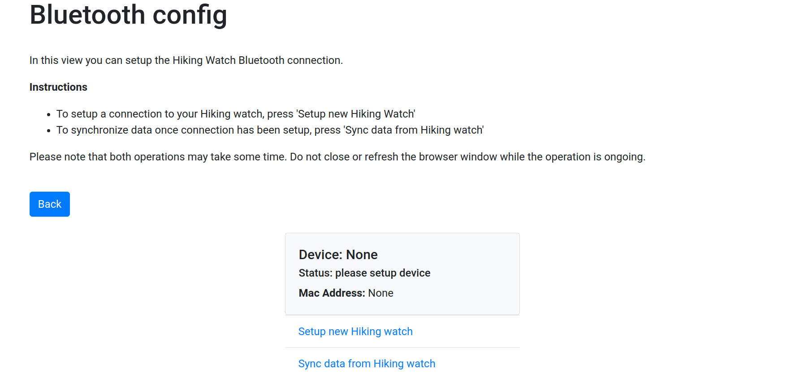

The links to pair a device and to synchronize data both use the spinner element from the Bootstrap CSS framework. The spinner element is widely used in web applications to indicate that an operation is ongoing. To users this is often communicated as the application "loading". In this application pressing both links sends a HTTP request that then in turn activates related Bluetooth functionalities in the code (either pairing or polling for data transfer). The "loading" in this case contains the whole process of HTTP requests and redirect and the Bluetooth operations that happen in the backend of the application. 

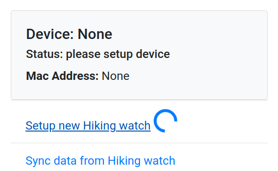{width=60%}

The configuration view also has the alert element from Bootstrap CSS framework. The alert element uses flash messages that are tied to the current session. Due to this, the application requires sessions to be implemented. Fortunately Flask provides easy tools for basic session management.  

In a success situation a green alert is shown with an informative prompt. 

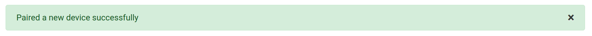

If the Bluetooth operation fails, the user is redirected normally, but the alert in this has red background color and an infromative message about the failure. Note that it should be considered carefully what information on the failure should be shared with the user. For instance, too much information may be useful for a malicious actor to misuse the system. 


Similarily with the polling for new data a spinner element is shown. 

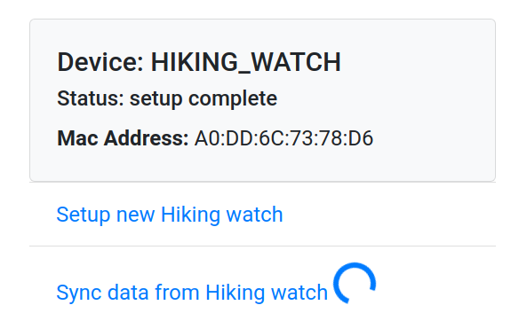{width=60%}

If the transfer succeeds, a notification will be shown. 


In case of failure, a warning notification is shown and some information on the cause of the failure MAY be shared. 

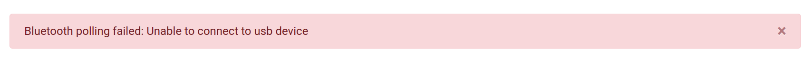


## LilyGO Hiking application: Documentation by module

This section details the LilyGO T-Watch Hiking Application code structure by module for the version 1.1 release. 

The high level scheduling of the modules is described in the image:


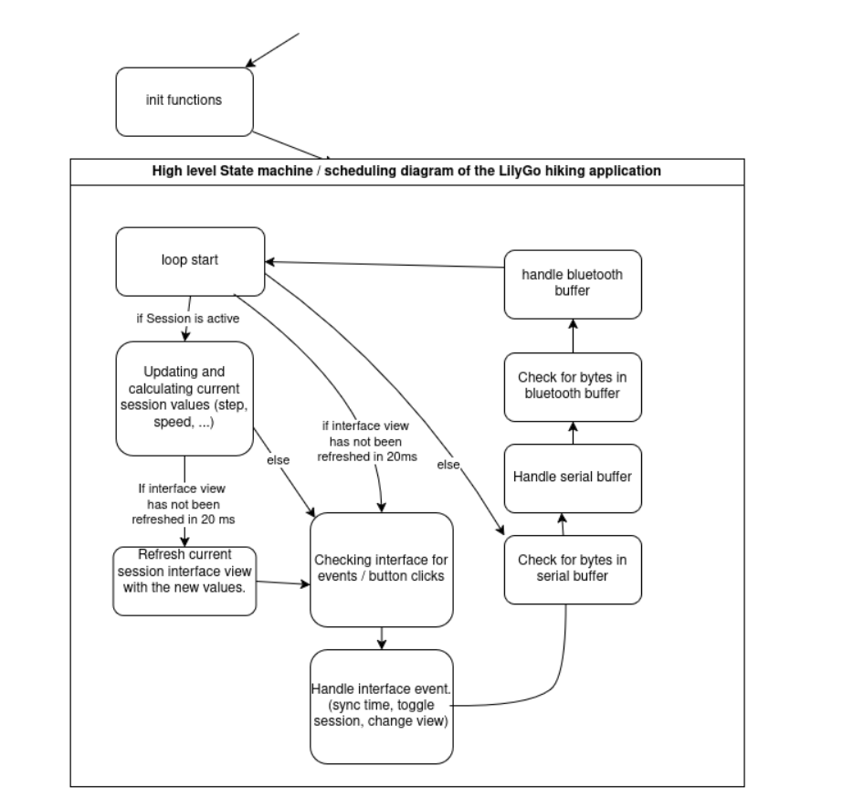{width=60%} 

Following a include tree of the LilyGo modules.


### accelerator


#### hidden

- `TFT_eSPI *tft`: Currently deprecated value.
- `BMA *sensor`: Contains the pointer to the accelometers sensor given by the ttgo object.
- `bool irqAcc`: boolean value depicting if the sensor has executed an interrupt. Is set as false at the beginning.
- `uint32_t currentSteps`: Value for counting the amount of steps taken.

#### public

- `void initAccelerator(TTGOClass *ttgo)`: Initializes the accelerator from the ttgo object.
- `uint32_t handleTasksAccelerator()`: Function for reading the sensors current steps.
- `void resetAccelerator()`: Resets the accelerators stepcount.

### bluetooth

#### hidden

- `String device_name`: Deprecated variable for device name.
- `String deviceName`: Variable for storing device name.
- `BluetoothSerial SerialBT`: Variable for storing the Bluetooth serial object.
- `bool commandFinishedBT`: Variable depicting if the command has finished or not.
- `int byteCountBT`: Variable for storing the byte that is currently read from Bluetooth.
- `char rxDataBT[BLUETOOTH_BUFFER_SIZE]`: Array for storing Bluetooth data.

#### public

- `#define BLUETOOTH_BUFFER_SIZE`: Constant for defining max buffer size for Bluetooth.
- `typedef enum bluetoothStatus`: Enum for depicting Bluetooth status.
- `typedef struct bluetoothBuffer`: Struct for implementing the Bluetooth buffer.
- `#define DEVICE_NAME`: Constant defining the TWatches Bluetooth name.  
- `void initBluetooth()`: Function initializing Bluetooth.
- `bluetoothBuffer handleBluetoothByte()`: Reads Bluetooth connection to device.
- `void writeBluetooth(char * data, int dataLen)`: Writes data to Bluetooth.

### config

#### public


- `#define TOUCH_INT`: Value needed for compilation. Set as 900909421094219090421.
- `#define MAX_CACHED_TRIPS`: Used to find out about the maximum amount of cached trips on the clock.

### data

#### public

- `#define GEO_MAX_SIZE` // Int with the size the arrays of the geoData struct are initilized as.
- `typedef struct timeStamp`: A type containing a timestamp consisting of members year, month, day, hour, minute and second. Year is of type uint16_t and the rest of type uint8_t.
- `typedef struct geoData`: A type for containing GPS data. Has members lattitude, longitude, datalen and timestamp. Lattitude and longitude are a array of double of size GEO_MAX_SIZE, datalen is of type int and timestamp is of type timeStamp
- `typedef struct tripData`: A type for storing the data of a single trip. Contains the members tripID of type int, stepCount of type uint32_t, avgSpeed of type float, distance of type float, synced of type bool and timestampStart and timestampStop of type timeStamp.
- `typedef struct systemGlobals`: A type for storing general information duroing the execution of the program. It has the members step_length of type float, currentTrip of type int, maxTrip of type int and hasActiveSession and GPSavailable of type bool.


### globals

#### public

- `timeStamp createTimestampFromRTC(RTC_Date date)`: function converting a RTC_Date object into a timeStamp struct. It transfers the values of year, month, day, hour, minute and second to the members of a timeStamp struct with the same names.
- `float getTimeDifference(timeStamp start, timeStamp stop)`: Returns a float containing the time difference between two timeStamp objects. The unit of measurement is second.

### gps

#### hidden

- `TinyGPSPlus *gps`: Pointer to store the gps object from the ttgo object.
- `HardwareSerial *GNSS`: Pointer to the hardware serial of the ttgo.
- `double lastLat`: Double value containing the latitude of the last step.
- `double lastLon`: Double value containing the longitude of the last step.
- `double avgLat`: Double value containing a sum of the latitudes that will be used to calculate the average latitude of a time period.
- `double avgLon`: Double value containing a sum of the longitude that will be used to calculate the average longitude of a time period.
- `int avgCount`: Counter for determining the amount of points in calculating the average.
- `uint32_t last`: Deprecated variable containing the millis() result when initializing the gps.
- `uint32_t updateTimeout`: Deprecated variable.
- `bool Quectel_L76X_Probe()`: Function cerifying that the gps settings are correct.

#### public

- `typedef struct GPSPoint`: Contains latitude of type double, longitude of type double and dist of type double. The lat and lon are the the latitude and longitude of a point and dist is the distance from the last point.
- `void initGPS(TTGOClass *ttgo)`: Function initializing the GPS. Uses the ttgo object.
- `void updateGPS()`: Function to update the gps values.
- `double getLatitude()`: Gets the latest latitude from the gps.
- `double getLongitude()`: Gets the latest longitude from the gps.
- `GPSPoint takeStep()`: Function to take a step in the trip. Returns a GPSPoint with the current latitude and longitude of the position and the distance to the last step.
- `void setRTCTime(PCF8563_Class *rtc)`: Function to set the current RTC time of the clock to the current GPS time.
- `bool isGPSavailable()`: Checks if the gps has been updated and the value is valid.
- `void addValueToAverage()`: Adds the current latitude and longitude to the avgLat and avgLon variables. Additionally adds 1 to the avgCount.
- `GPSPoint takeAverageStep()`: Function to take a step in the trip using average values. It returns a GPSPoint containing the avgLat and avgLon divided by avgCount. The distance is the distance between the average coordinates and the last step.

### interface

#### hidden

- `bool displayOn`: Variable tracking if the display is on or off.  
- `bool irqPEK`: Variable tracking if the PEK button is pressed.  
- `bool GPSavailable`: Deprecated variable.  
- `uint32_t stepCount`: Variable for saving the current stepcount.  
- `float step_length`: Variable containing the length of a step.  
- `float avgSpeed`: Variable containing the current average speed.  
- `float distance`: Variable containing the current distance.  
- `timeStamp sessionStartTime`: Variable containing the start time of the session.  
- `timeStamp currentTime`: Deprecated variable for containing the current time.  
- `bool hasActiveSession`: Variable for tracking if a session is currently active.  
- `uint32_t nOfTrips`: Variable containing the amount of taken trips.  
- `tripData *pastTrips`: Variable containing a pointer to the tripdata object.  
- `interfaceEvent returnData`: InterfaceEvent containing the current event.  

There are a lot of variables of type lv_obj_t* containing the pointers to different interface elements like the views, buttons and labels.

Variables of type lv_style_t are for saving different styles.

- `static void event_handler(lv_obj_t *obj, lv_event_t event)`: Function for handling interface events.
- `void refreshSessionView()`: Function for updating the session view.
- `void init_global_styles()`: Function for setting the global style configuration.
- `void loopWakeUpFormTouchScreen(TTGOClass *ttgo)`: Function for handling turning the screen on and off using the PEK button.
- `void setupToggleScreen(TTGOClass *ttgo)`: Function for setting up screen on and off functionality.

#### public

- `typedef enum interfaceEventType`: Enum containing the different types of interface events.
- `typedef struct interfaceEvent`: Struct containing a interfaceEventType of the value of the event and a char pointer to a null terminated string containing a message.
- `void createMainMenuView()`: Function creating the view of the main menu.
- `void createSessionView()`: Function creating the view for the current session.
- `void createSettingsView()`: Function creatig the view for the settings menu.
- `void createPastSessionsView()`: Function creating the view for the past session.
- `void updatePastSessionData()`: Function for updating the view of the past sessions.
- `void initInterface(TTGOClass *ttgo)`: Function for initializing the interface variables.
- `interfaceEvent handleTasksInterface(TTGOClass *ttgo, tripData * trip, systemGlobals * systemVariables, bool isRefreshSessionView, tripData * trips)`: Function for handling tasks concerning the interce and updating it.

### restful

#### hidden

- `httpType restfulParseType(const char* data, const int *dataLen)`: Function for determining the type of restful request.
- `int restfulParseAddress(restfulPacket * packet, char * data, const int * dataLen)`: Function for returning the restful path from a request. 
- `int parseRestfulPacket(restfulPacket * packet, char * data, const int * dataLen)`: Function parsing the packet.
- `int setResponseError(restfulPacket * packet)`: Function for setting the return as an error.
- `int setResponseMainView(restfulPacket * packet)`: Function for returning the main view in the response.
- `int setResponseTrips(restfulPacket * packet)`: Function for returning the trips view in the response.
- `int setResponseOneTrip(restfulPacket * packet, tripData *trips)`: Function for returning the trip data for one trip in the response.
- `int getAddressContent(restfulPacket * packet, tripData *trips)`: Function for getting the address content of a query.
- `int setResponseSuccessAction(restfulPacket * packet)`: Function setting the response to a success.
- `int setTag(restfulPacket * packet, tripData *trips)`: Function for setting the tag on a trip.
- `int postAddressContent(restfulPacket * packet, tripData *trips)`: Function for posting the content of the restful package.

#### public

- `#define MAX_RESTFUL_RESPONSE_SIZE`: Constant for maximum size of restful response.
- `#define MAX_RESTFUL_REQUEST_SIZE`: Constant for maximum size of requests.
- `#define RESTFUL_MAIN_VIEW_PATH`: Path for main view in restful.
- `#define RESTFUL_MAIN_VIEW`: Restful main view.
- `#define RESTFUL_TRIPS_VIEW_PATH`: Path to trip view in restful.
- `#define RESTFUL_TRIPS_VIEW`: Restful trips view.
- `#define RESTFUL_TRIPS_VIEW_PATHS_LIST_ENTRY`: Path to individual trip in restful.
- `#define RESTFUL_ONE_TRIP_VIEW_PATH`: Path to getting trip data.
- `#define RESTFUL_ONE_TRIP_VIEW`: Restful view for trips.
- `#define RESTFUL_GEODATA_VIEW_PATH`: Path for getting geodata in restful.
- `#define RESTFUL_ERROR_PATH`: Path to restful error.
- `#define RESTFUL_ERROR_VIEW`: Restful view for errors.
- `#define RESTFUL_TRIP_ACTION_SET_TAG`: Restful command for setting the tag on a trip.
- `#define RESTFUL_SUCCESS_ACTION`: Response for performing a successful action in restful.
- `enum restfulTripStatus`: Enum for the different states a trip can have.
- `typedef struct restfulTripData`: Struct for storing trip data for restful queries.
- `typedef struct restfulGeolocation`: Struct for storing geolocation data for restful queries.
- `typedef enum httpType`: Enum for the different http request types.
- `typedef struct restfulPacket`: Struct representing a restful query.
- `restfulPacket restfulHandlePacket(char *data, const int *dataLen, tripData *trips)`: Function processing restful queries.


### serial

#### hidden

- `bool commandFinishedSer`: Variable for storing if a command has finished.
- `int byteCountSer`: Number of the current byte that is being processed.
- `char rxDataSer[SERIAL_BUFFER_SIZE]`: Array for buffering data.

#### public

- `typedef enum serialStatus`: Enum depicting the status of the serial interface.
- `typedef struct serialBuffer`: Struct containing buf of type char*, bufLen of type int and status of type serialStatus.
- `void initSerial()`: Function initializing the serial functionality.
- `serialBuffer handleSerialByte()`: Function reading a byte per call and append to a buffer.
- `void writeSerialString(char * data)`: Writes the data variables contents to serial.
- `void writeSerial(char * data, int dataLen)`: Writes the data variables contents to serial up to datalen.
- `void writeSerialRTCTime()`: Deprecated function for writing the RTC time to serial.
- `void writeSerialRTCDateObj(RTC_Date date)`: Function writing the date objects information to serial.
- `void writeSerialRTCDateObj(timeStamp date)`: Function writing the date objects information to serial.


## Development methods and tools

This subsection describes some maintaining and development related topics. Certain principles should be followed when developing new features / modules to smartwatch. Also testing and modules require external tools to help develop and test.

### Methods

#### Programming principles for smartwatch codebase

The codebase is based on classes and object oriented coding. This allows a high level access to everything and possibility to very complicated procedures. This allows readability for the frontend web features to relate easily with the backend.

Features should adhere with the current classes within the codebase. Future releases may include new classes if they clearly do not fit the scope of the current classes.

#### Programming principles for web application codebase

Different features should use their own standalone header files (prefix .h). Features using LilyGo libraries needs to be careful and use the same file where the LilyGo library is called. The LilyGO sdk library uses certain shared static functions which should be called only once.

The main file (.ino) describes the scheduling, polling and timings of all modules and features within the firmware. This should be respected to avoid any monolithic growth of the codebase. The codebase is using a flat structure as it is relatively small project:

```
|--> config.ini
|--> install.sh
|--> lilygo-hiking-application.ino
|--> src/
    |--> accelerator.cpp
    |--> accelerator.h
    |--> bluetooth.cpp
    |--> bluetooth.h
    |--> ...
    |--> step.cpp
    |--> step.h
```

In the above file structure is shown the most important parts of the codebase for code development. The install.sh and the config.ini are for compiling. Main operation is described in .ino and src directory includes all features as header files.

### Developing Tools

The development is best done by running a common linux distribution. Any linux system with working bluetooth should be able to compile, upload, synchronize and host the web application. 

#### Serial access

Modules and functions can be programmed to return strings to be displayed through serial. 

To read serial of the LilyGo hardware these can be used:

1. picocom
2. minicom
3. screen
4. arduino-ide

Also there is a serial monitoring script bundled with the LilyGo hiking application codebase. 

#### Bluetooth access

Good way for testing bluetooth accessibility or the restful is to use a bluetooth serial terminal.

We used the [Serial Bluetooth Terminal](https://play.google.com/store/apps/details?id=de.kai_morich.serial_bluetooth_terminal&hl=en&pli=1) for android:


