

# Introduction

The purpose of this document is to provide Hiking Band users the required information to successfully launch, configure and utilize the core functionalities of the Hiking Band system. The system consists of two applications: the Raspberry Pi Web Application and LilyGO T-watch smartwatch hiking application. This document contains a section for each application and a section for communication between applications.  

A test plan has been included for both applications for the purpose of detailing to QA specialists how it can be verified that the application works as intended. Additional information for testing can be found from the SRS documentation. It is important to highlight, however, that the SRS may contain optional features that have not been implemented in the proof-of-concept version. All non-optional features listed in SRS SHOULD be available and optional features MAY be available. 



# LilyGO T-Watch Hiking application

The LilyGO T-Watch Hiking application is a proof-of-concept (later in this section PoC) smartwatch application for tracking hiking trips. The application uses LilyGO T-Watches BMA423 accelerometer to track step count and LilyGO T-Watches M8/M6 GPS Module to track the travelled distance. Average speed is computed by recording the start time of the hike and calulating average speed from tracked distance and hike duration.  Users can also view information from past hikes and configure Bluetooth synchronization from the settings menu. 

## Requirements 

Before getting started, make sure that you have the following hardware components:

- LilyGO T-Watch V2
- A Raspberry Pi 3B+ with a Linux-based OS
- A USB-A to micro-USB cable

::: {.callout-tip}
While the LilyGO hiking application officially supports V2 of the LilyGO T-Watch smartwatch, the application MAY also work on V3 with configuration changes. The configuration changes are detailed in the design report. Note that V3 is not officially supported. 
:::



## Tutorial

This section introduces the basic functionalities of the LilyGO T-Watch. 

### Turning on the smartwatch

To turn the smartwatch on or off, press PEK-button for multiple seconds. 

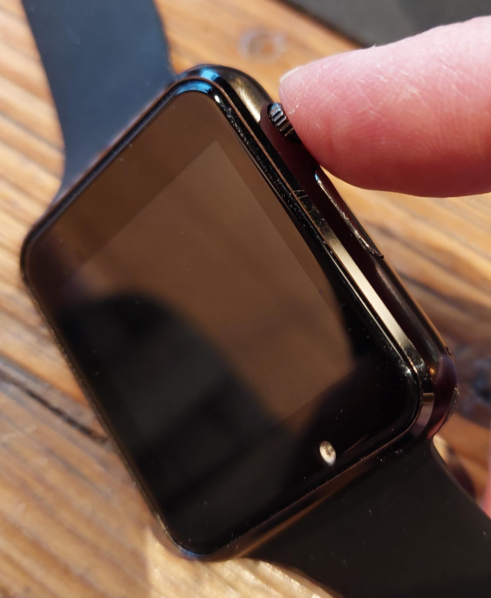{width=30%}  

### Toggling smartwatch screen

To toggle smartwatch screen on and off without shutting the smartwatch off, press the PEK button shortly. 

### Starting a hiking session

To start a new hiking session:  

1. In main view press 'Session view' button

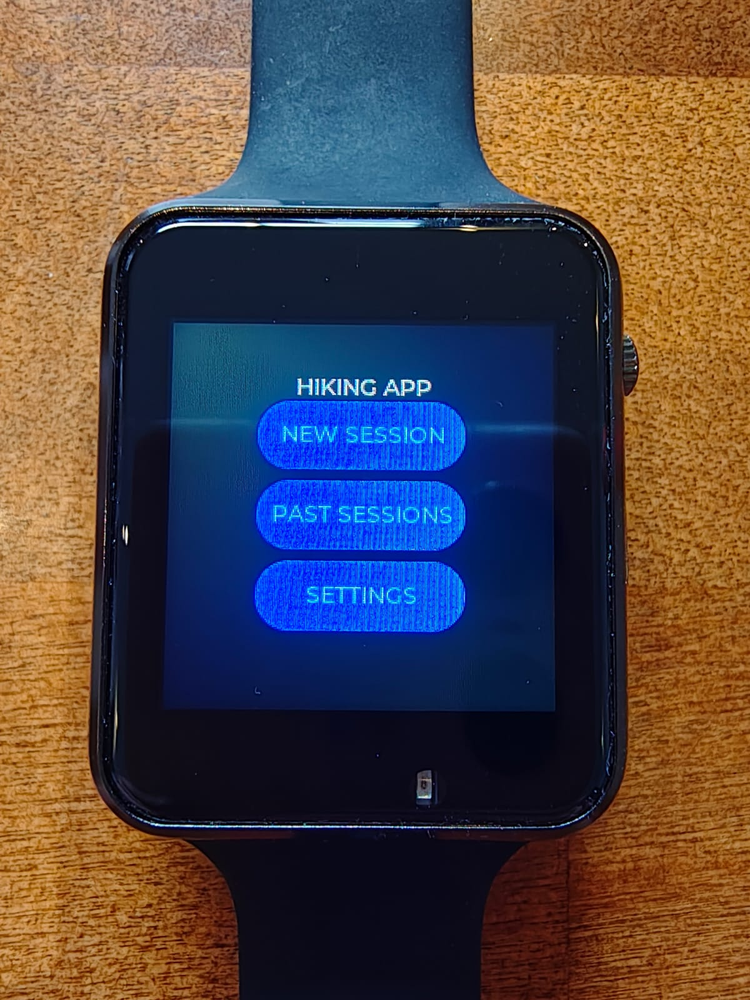{width=30%}  

2. In Session view press 'Start' button

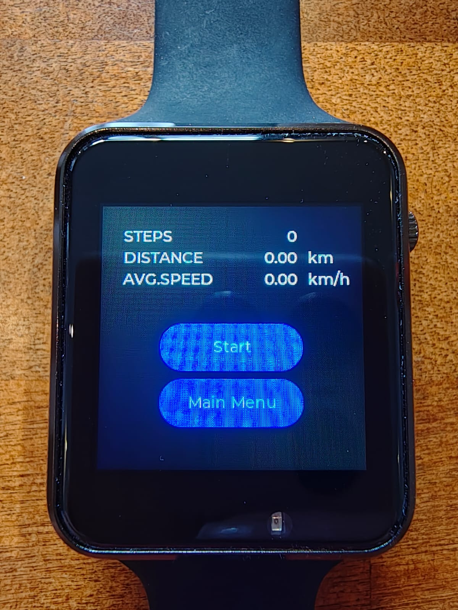{width=30%}

To end a hiking session:  

1. Navigate to 'Session view'
2. Press 'Stop' button

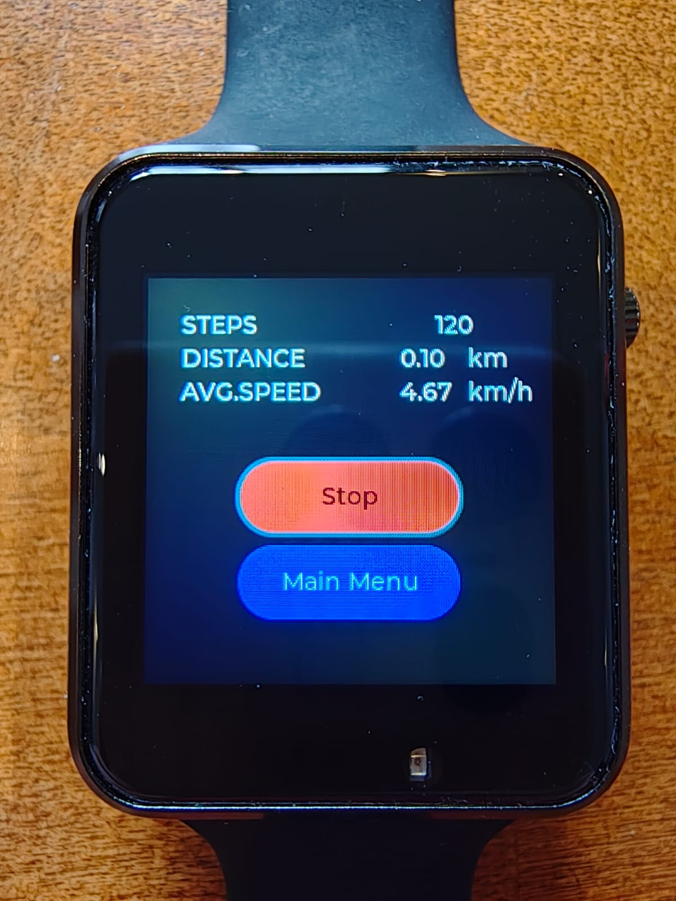{width=30%}

::: {.callout-tip}
While a hiking session is active, you can:  

1. Navigate to other views in the smartwatch application
2. Toggle the touch screen on/off with the PEK-button
:::

### Viewing past hiking sessions

To view past hiking sessions:  

1. Navigate to past session view from the main view

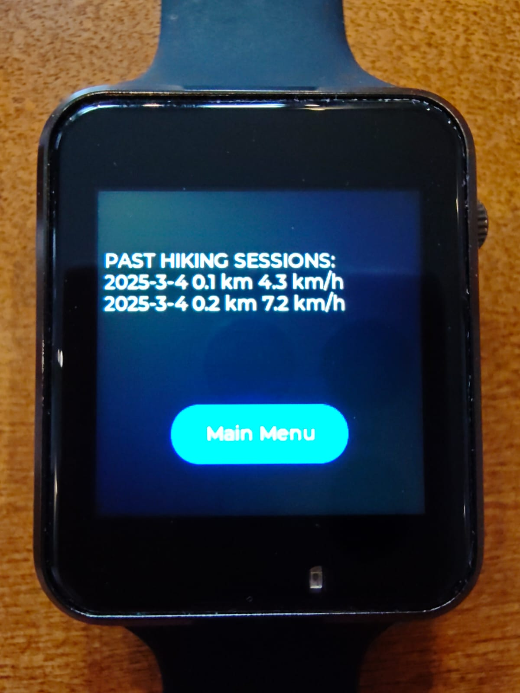{width=30%}

::: {.callout-note}
If there are no previous session, a prompt will indicate that no hikes have been recorded. Otherwise past sessions will be listed. 
:::

### Managing settings 

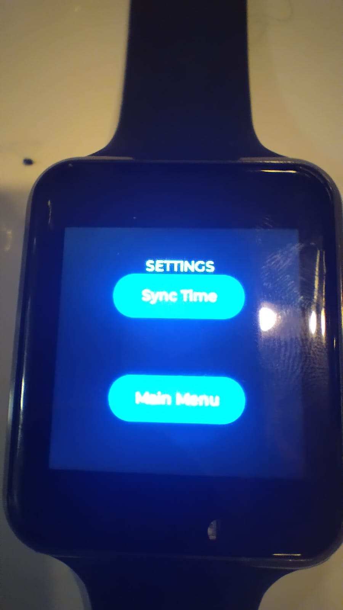{width=30%}

The settings view will include all possible configurable settings. Currently it includes the option to "sync time". This button can be used to correct the offset of the smartwatch. 

## Test plan

At this PoC stage the, test plan relies on manual testing. The functional requirements of the smart watch detailed in the SRS documentation can all be tested manually. A comprehensive list of testable features have been collected to the following subsections. These collections should assist the QA specialists in implementing suitable tests to verify that the functionalities work as intended. This section assumes that the QA specialist is performing black-box testing, i.e. testing a then functional and non-functional requirements on system or acceptance test level.

### Navigation

- User can navigate from main view to:
  - session view
  - past sessions view
  - settings view
- user can navigate back to main view from all other views

### Session view

- When user presses start - button
  - application begins tracking user's movement and incrementing step count
  - the session data is displayed on the view, including
    - step count
    - distance
    - average speed
  - the session data is updated at maximum within 2 seconds when user is in active movement. 
  - the start button turns red and the button label changes to "stop"
- When user presses stop - button
  - applicatin stops tracking user's movement
  - the stop button turns blue and the button label changes to "start"

### Past sessions view

- The past session view contains information on stored sessions:
- For each session the following information is shown:
  - date of the session
  - traveled distance
  - average speed
- the watch stores at maximum five past hike sessions
- if five hiking sessions have been recorded, the oldest entry will be overwritten when the next session begins

### Settings view

::: {.callout-important}
TODO: Write this section!
:::



# Raspberry Pi Web Application

The purpose of the web application is to store data from hiking trips to persistent memory and to display data in the web application views. The web application has been designed for Raspberry Pi3B+ board with a Raspian Operating System. The Web Application requires a internet connection to work properly, as it uses external dependencies for styling.  

## Tutorial

This section details the functionalities the web application provides once it is running locally. Navigate to the application with you browser. By default Flask applications run in port 5000 on localhost. By typing `localhost:5000`(or `127.0.0.1:5000`) to your browser, you should land on the main view. 

### Main view

The main view has two navigational buttons:  

1. Button `Show all hikes` navigates to a view that shows all hikes
2. Button `Configuration` navigates to a view in which the bluetooth connection can be configures

The main view additionally visualizes selected data from past hikes:  

  1. Last hike taken
  2. Average values for all hikes in persistent memory
  3. Hike with the longest distance
  4. Hike with the fastest average speed

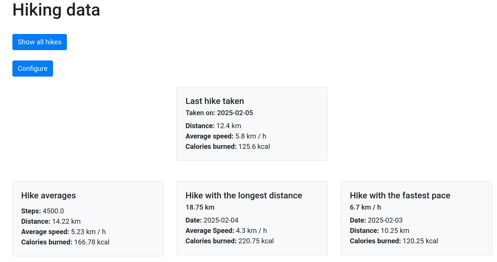{width=60%}

### Past hikes view

The past hikes view includes a table that lists all past hikes in persistent memory. For each hike the following information is shown:  

  - ID (automatically generated for the database)
  - Date
  - Distance
  - Steps
  - Calories
  - Average Speed

Each table row also includes a `Delete` button, that allows the user to delete the hike in question. 

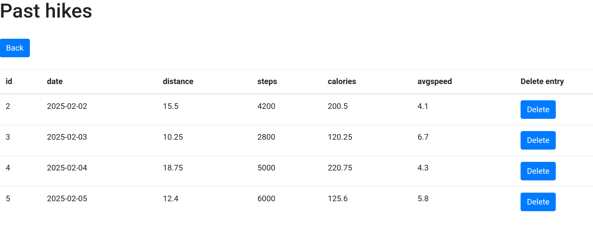{width=60%}

Pressing Delete opens a confirmation Monad. By pressing delete, the action is confirmed. By pressing cancel, confirmation Monad is closed and no action is taken.

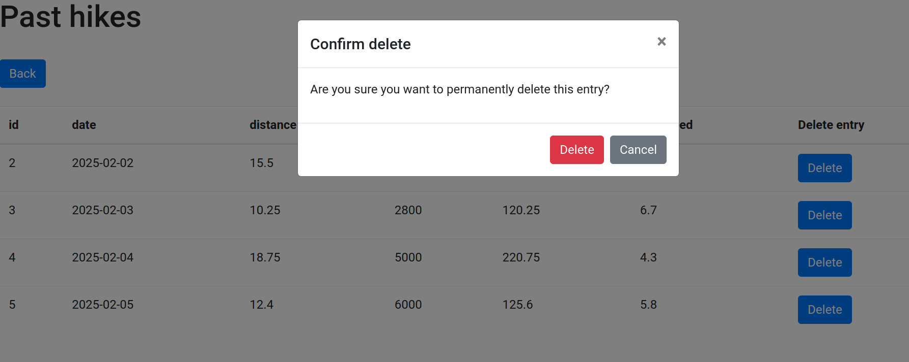{width=60%}



### Configuration view

In the configuration view user can 

- pair a new LilyGO T-Watch device with the Web Applicatoin
- Synchornize data from the LilyGO T-Watch to the persistent data storage on the Web Application 

#### Pairing a new device

Before pairing, the configuration view indicates that no T-Watch has been paired with the Web Application

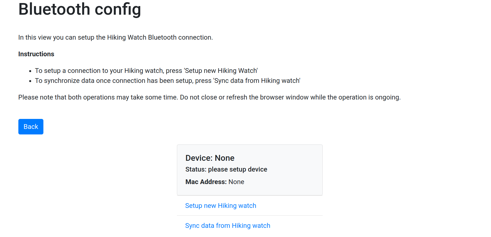



To pair a new T-Watch, first ensure that the T-Watch is turned on. Then click the 'Setup new Hiking watch' link. A spinner indicates that an operation is ongoing. Do not leave the view while the spinner is visible

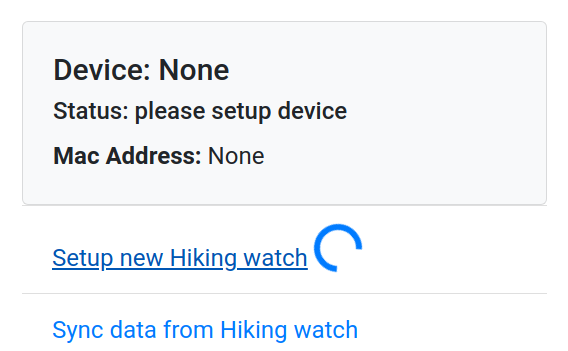{width=60%}

If the pairing succeeds, the connection information is shown in the card element and a notification of successful operation is shown. 

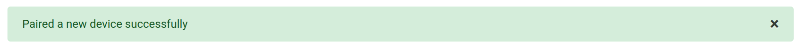

If the pairing fails, user is notified with a warning alert. 

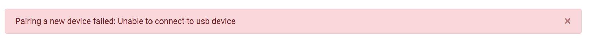



#### Synchornizing data 

To synchronize hiking data from the LilyGO T-Watch to the persistent local storage of the Web Application, press the 'Sync data with Hiking watch' link. A spinner indicates that an operation is now ongoing. Do not leave the view while the spinner is visible. 

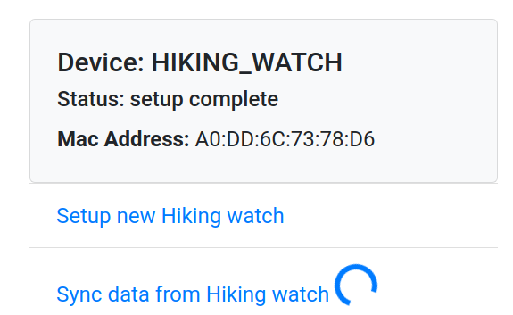{width=60%}

If the transfer succeeds, a notification will be shown. 

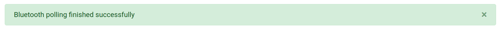

In case of failure, a warning notification is shown and some information on the cause of the failure MAY be shared. 

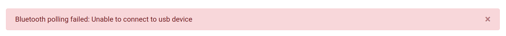



## Test plan

At this proof-of-concept stage the, test plan relies on manual testing. A comprehensive list of testable features have been collected to the following subsections. These collections should assist the QA specialists in implementing suistable tests to verify that the functionalities work as intended. This section assumes that the QA specialist is performing black-box testing, i.e. testing a then functional and non-functional requirements on system or acceptance test level. 

### Main view

- The main view contains navigation buttons to 
  - hikes view and 
  - configuration view
- The main view additionally contains some key information from past sessions:
  - The last recorded session
  - The session with longest travelled distance
  - The session with fastest average speed
  - Averages for step count, distance, average speed and burned calories all sessions
- If no data is in database, data cards are rendered and indicate that no data is available. 

### Hikes view

- The hikes view contains a table of past hikes
    - data is correctly shown in the table
    - data with missing values is displayed correctly
    - empty table is displayed correctly 
- Each row contains the following information
  - id 
  - date
  - step count
  - distance
  - average speed
  - burned calories
- additionally each row contains a Delete button from which the selected entry can be deleted
  - pressing the delete button activates a modal in which user is asked to confirm deletion
  - after confirmation, entry is deleted and the user is redirected to the hikes-view 

### Configuration view

- When a LilyGO T-Watch has not been paired, the card element indicates that no device has been paired
- When user clicks the 'Setup new hiking watch' a spinner element is rendered indicating that an operation is ongoing
  - If the pairing succeeds user is redirected to the configuration view and an alert element is shown indicating success 
  - If the pairing fails, user is redirected to the configuration view and an alert element is shown indicating failure
- When user clicks the 'Sync data from Hiking watch' link, a spinner element is rendered inidicating indicating that an operation is ongoing. 
  - If data synchornization succeeds, user is redirected to the configuratoin view and an alert element is shown indicating success
  - If data synchronization fails, user is redirected to the configuratoin view and an alert element is shown indicating failure

# Communication between devices

The web application handles communication between the devices. Please follow the instructions in the Web Application settings to pair the Hiking watch with the web application and to synchornize hiking data to the persistent local data storage on the web application. 

::: {.callout-note}
Remember to turn the Hiking watch on before initiating communication between the devices. 
:::

